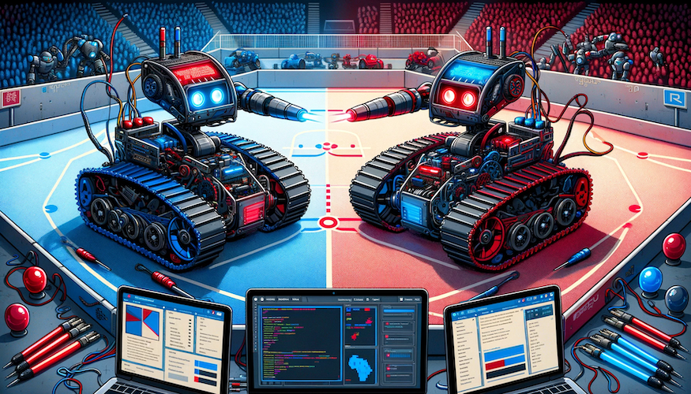
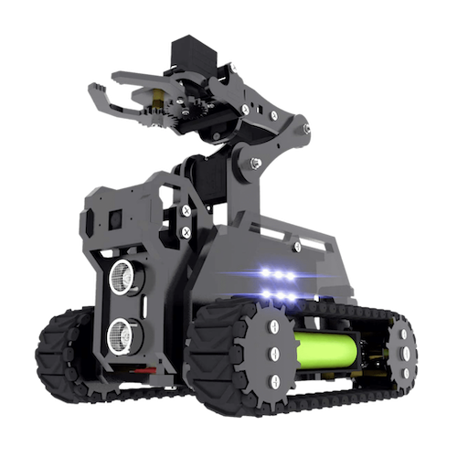

# Projet Programmation Réseau M1 IoT

## Présentation

Ce projet a pour objectif de programmer un petit robot pour participer au jeu *World of Rasptank*.

### *World of Rasptank*

  

Ce jeu implique deux équipes : une équipe bleue et une équipe rouge. Les participants sont répartis équitablement entre ces deux équipes. Chaque équipe dispose d'une base. Le but est de capturer le drapeau placé au centre du terrain et de le rapporter à sa base.

Pour capturer le drapeau, il faut rester 5 secondes dans la zone de capture.

:warning: **Attention** :

- Si vous portez le drapeau et que vous êtes touché, vous le perdez. Le drapeau retourne alors automatiquement à la zone de capture.
- Si vous êtes touché pendant la capture du drapeau, celle-ci est annulée. Vous devrez sortir de la zone puis y re-entrer pour recommencer la capture.

Pour déposer le drapeau dans votre base, scannez le QR code présent dans celle-ci. Une équipe gagne la partie en rapportant trois drapeaux dans son camp.

## Consignes

Vous travaillerez en binôme et disposerez d'un "Rasptank", un petit robot chenillé piloté via un Raspberry Pi.

## Objectifs

L'évaluation finale consistera en une partie de *World of Rasptank*. Il est donc essentiel d'avoir un robot opérationnel pour la dernière séance. Voici les fonctionnalités à implémenter pour que votre robot puisse participer :

#### Rasptank

- Contrôle à distance.
- Déplacement dans toutes les directions.
- Tir via un émetteur infrarouge.
- Réception de tirs par un récepteur infrarouge.
- Détection de l'entrée dans la zone de capture (zone blanche) grâce au module suiveur de ligne.
- Streaming en temps réel du flux vidéo de la webcam*.

(*): Non obligatoire, mais recommandé.

#### Télécommande

Vous avez carte blanche concernant la télécommande, mais elle doit permettre au moins :

- L'envoi de commandes au Rasptank (déplacements, tirs, etc.).
- La visualisation du stream de la webcam.

### Documentation

Sur le Git, vous trouverez des guides pour chaque partie du projet, offrant des explications sur le code fourni et des suggestions pour développer les fonctionnalités requises.

Toutes les approches présentées sont viables. Vous avez la liberté de choisir celle qui vous semble la plus appropriée, ou même d'adopter une méthode non décrite dans le guide.

Les choix d'implémentation que je recommande sont signalés par une étoile :star:. Si vous ne privilégiez pas une méthode en particulier, suivre ces recommandations peut être une bonne option.