# Séance FabLab

### Objectifs :
- Fabrication du support de l'émetteur IR :
    - Conception du support
    - Impression du support
    - Montage du support
- Remplacement du bras robotique :
    - Conception du nouveau bras
    - Impression des pièces
    - Démontage et installation du nouveau bras

## 1. Conception du Support de l'Émetteur IR

1. Créez le croquis de la base (rectangle de 36x31 mm).

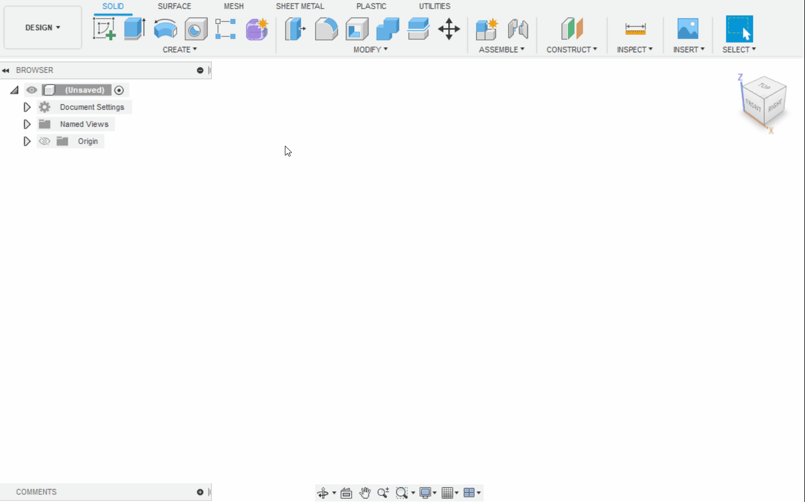

2. Donnez du volume à ce rectangle (3 mm).

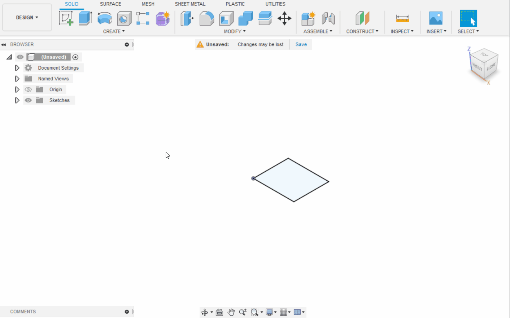

3. Créez le croquis suivant (21x3 mm).

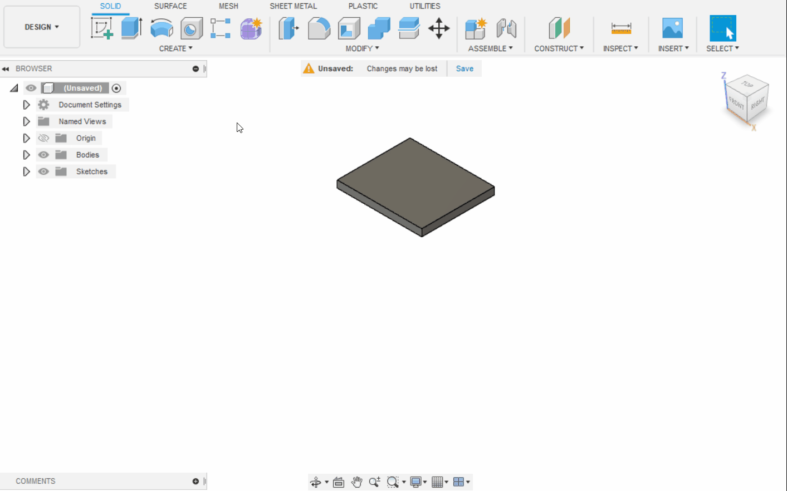

4. Extrudez négativement le croquis pour le creuser (8 mm).

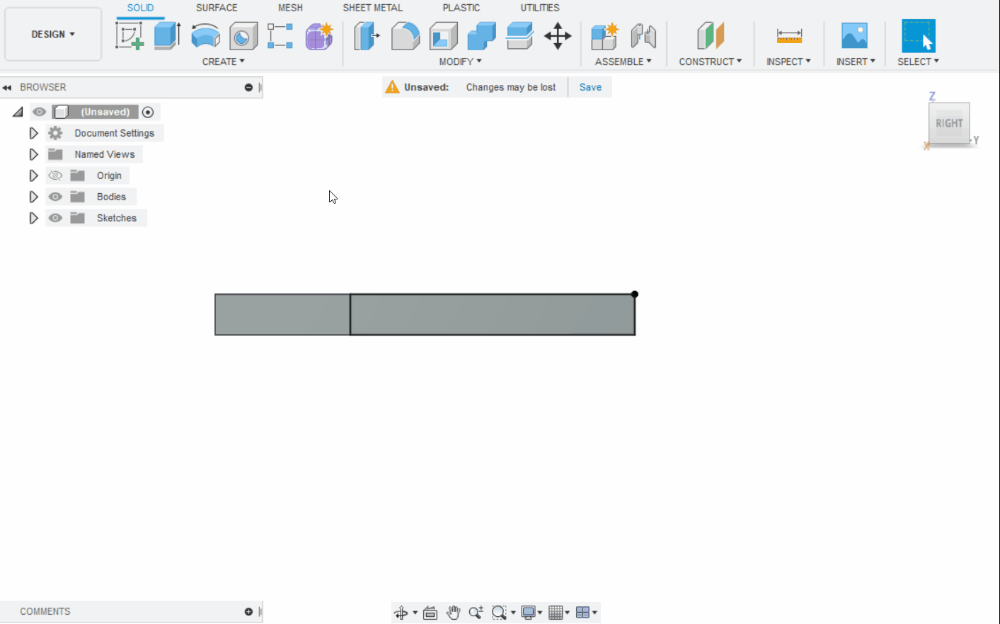

5. Créez le croquis suivant (21x4 mm).

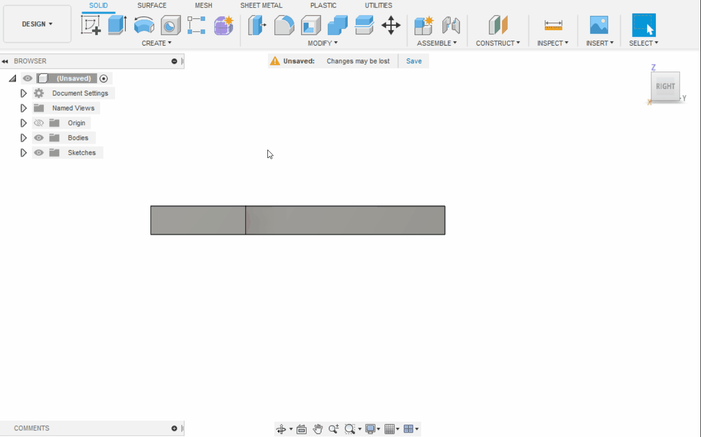

6. Extrudez le croquis (6 mm).

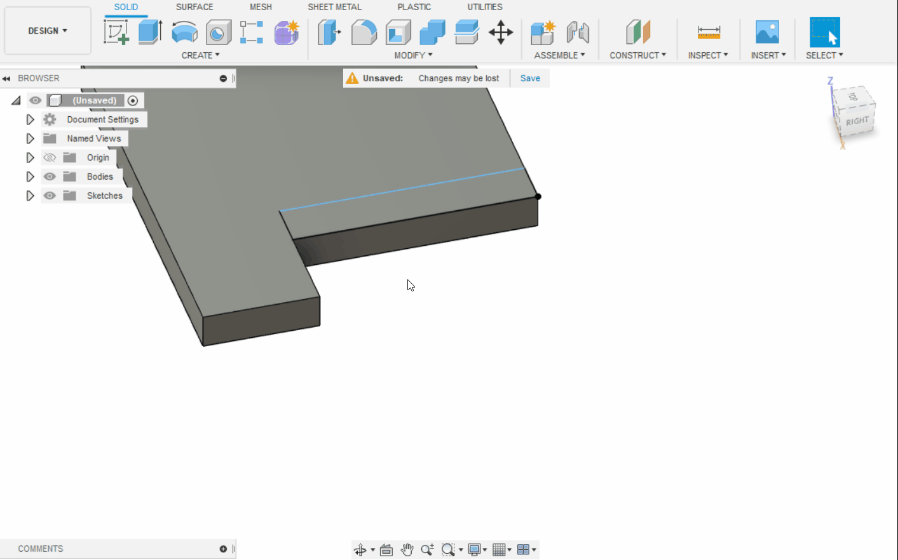

7. Créez le croquis suivant (19x2 mm).

8. Extrudez négativement le croquis (2 mm).

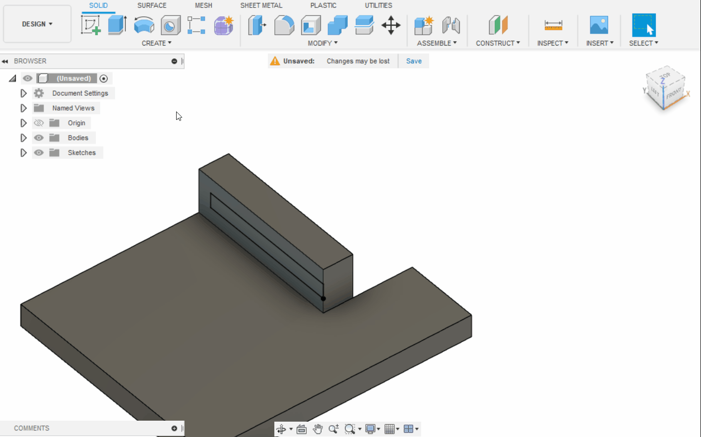

9. Répétez la même opération de l'autre côté.

10. Créez le croquis du trou pour la vis de fixation du servo.

11. Extrudez.

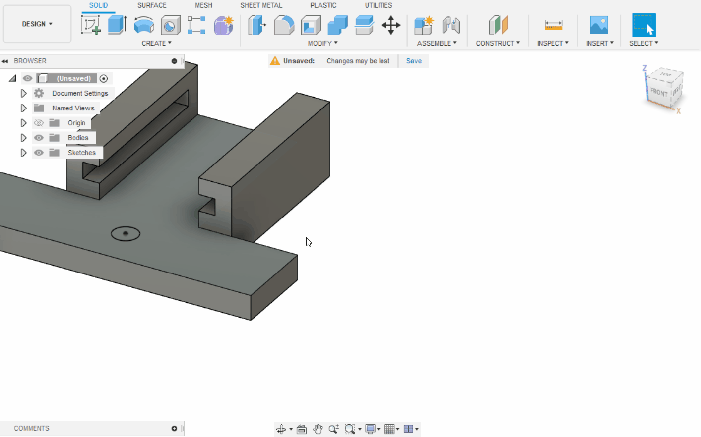

12. Créez le croquis du trou pour la vis de fixation latérale droite.

13. Extrudez.

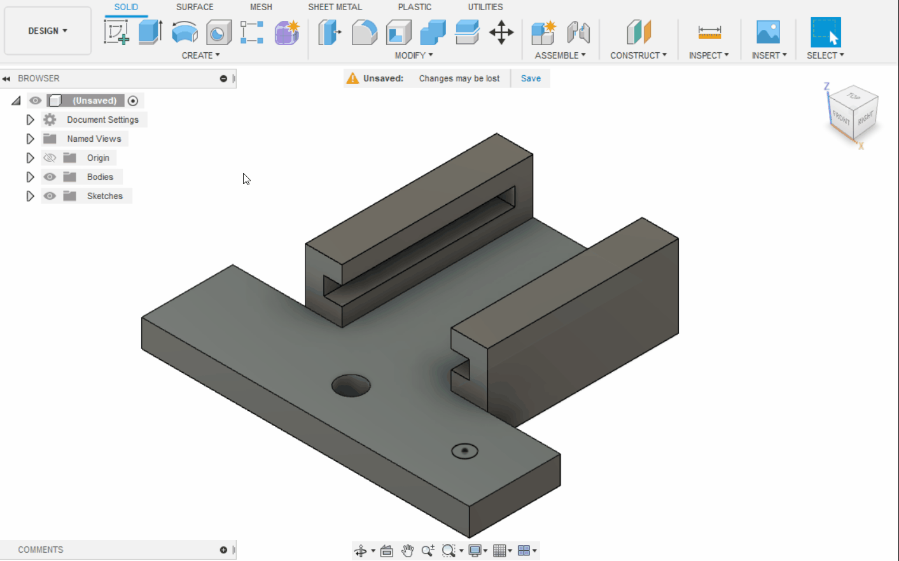

14. Répétez pour le côté gauche.

15. Arrondissez le coin inférieur droit.

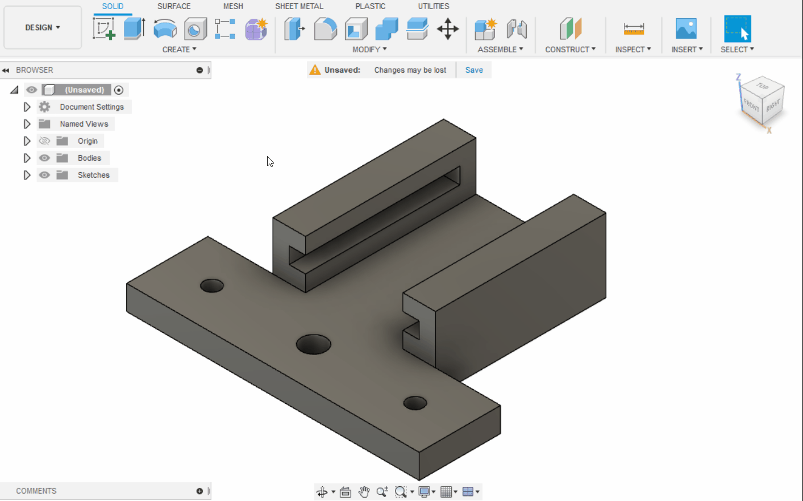

16. Faites de même pour les autres coins.

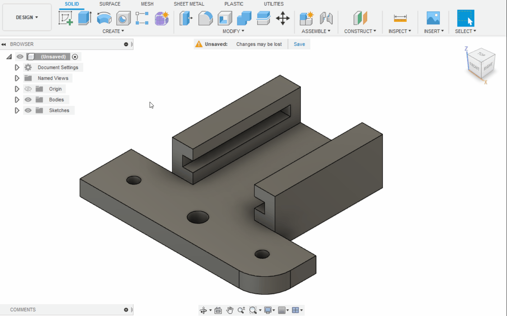

## 2. Impression du Support de l'Émetteur IR

1. Votre pièce est maintenant terminée, vous devez l'exporter en fichier STL pour l'impression.

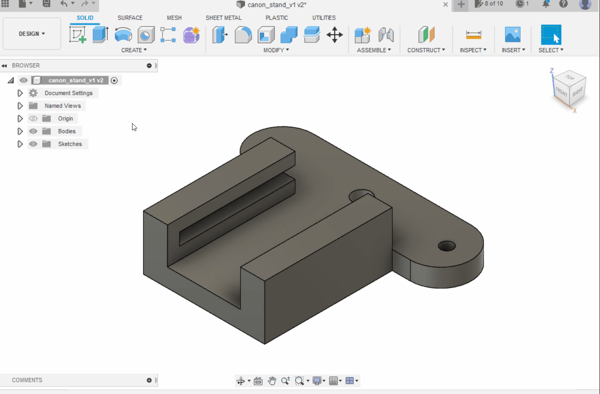

2. Importez le fichier STL dans PrusaSlicer.

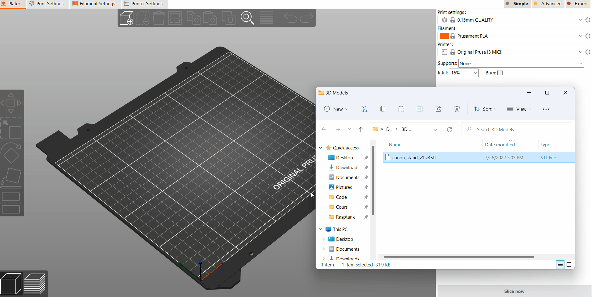

3. Slicez l'objet 3D et enregistrez le fichier G-code sur votre carte SD.

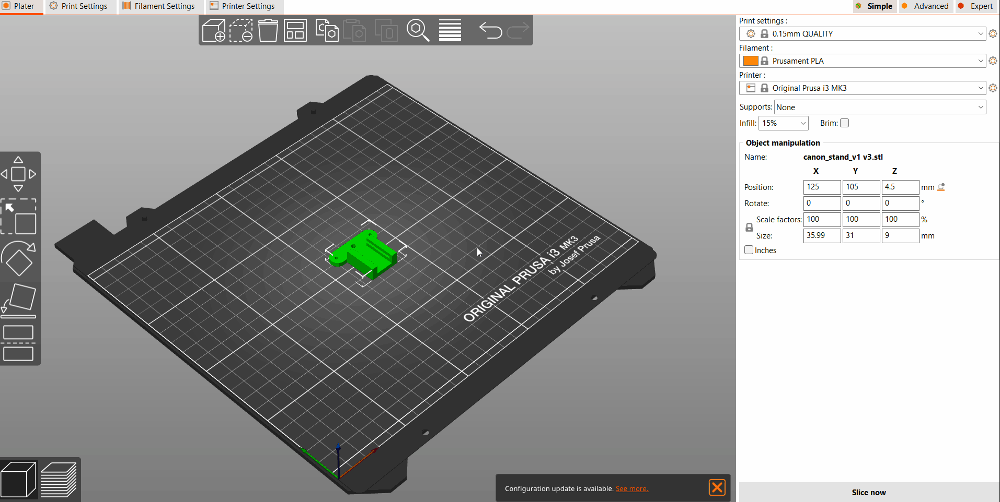

4. Vous pouvez maintenant imprimer votre support.

## 3. Montage du Support de l'Émetteur IR

Pour monter le support, positionnez-le à l'emplacement de la pince comme indiqué sur la photo ci-dessous.

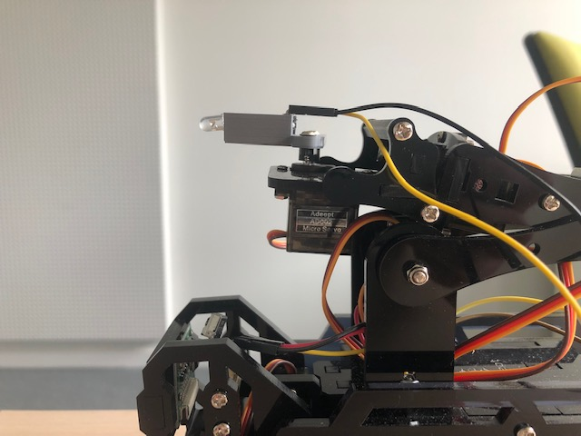

### Câblage de l'Émetteur IR

Détails de la connectique de l'émetteur et du récepteur infrarouge :

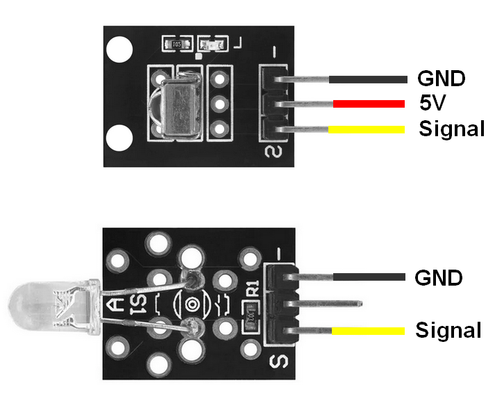

Connectez le 5V et la masse (GND) aux pins 5V et GND réservés aux servos. Les pins *signal* seront reliés à des pins GPIO du Raspberry Pi.

Utilisez les connectiques RGB du *Motor Hat V2* pour l'émetteur et le récepteur infrarouge, car les GPIO sont déjà occupés.

Schéma du montage final :

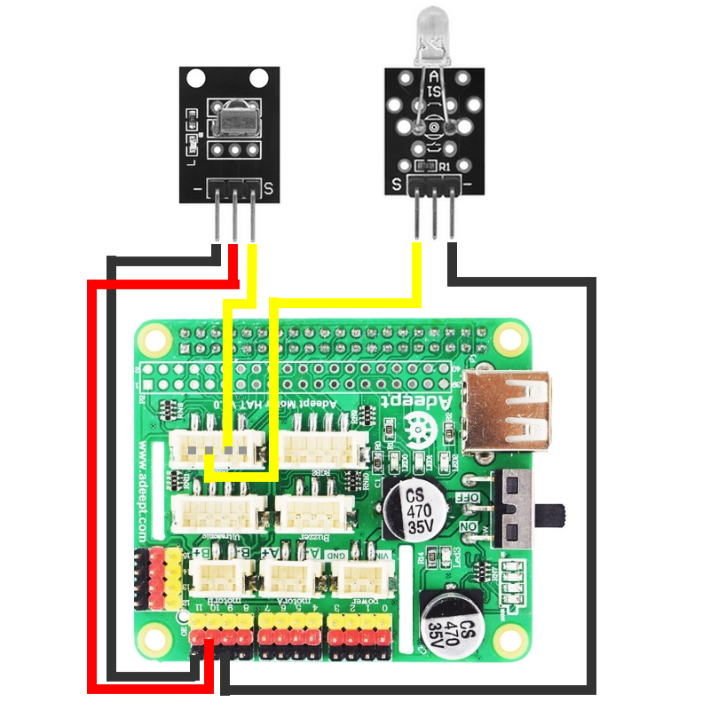

:information_source: Le GPIO pour le récepteur est le GPIO 23 et pour l'émetteur, le GPIO 22. Vous pouvez inverser ces connexions, mais notez bien leur configuration.

## 4. Conception du Nouveau Bras Robotique

*Contenu à venir*

## 5. Impression des Pièces du Nouveau Bras

*Contenu à venir*

## 6. Installation du Nouveau Bras

*Contenu à venir*