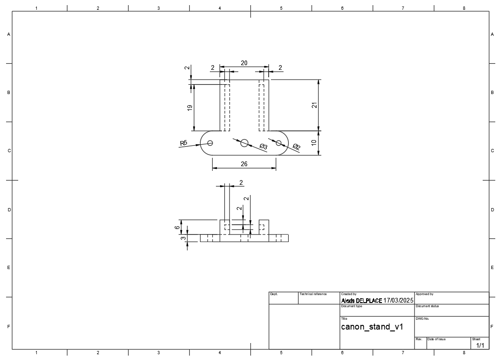

# Séance FabLab

### Objectifs :
- Fabrication du support de l'émetteur IR :
    - Conception du support
    - Impression du support
    - Montage du support

## 1. Conception du Support de l'Émetteur IR

Voici les premières étapes. Ces étapes constituent l'ensemble des actions dont vous avez besoin pour créer la pièce, à savoir créer un croquis (sketch), donner du volume à un croquis, et retirer du volume.

1. Créez le croquis de la base (rectangle de 36x31 mm).

2. Donnez du volume à ce rectangle (3 mm).

3. Créez le croquis suivant (21x3 mm).

4. Extrudez négativement le croquis pour le creuser (8 mm).

Voici le plan de la pièce que vous devez créer, à vous de jouer.

## 2. Impression du Support de l'Émetteur IR

1. Votre pièce est maintenant terminée, vous devez l'exporter en fichier STL pour l'impression.

2. Importez le fichier STL dans PrusaSlicer.

3. Slicez l'objet 3D et enregistrez le fichier G-code sur votre carte SD.

4. Vous pouvez maintenant imprimer votre support.

## 3. Montage du Support de l'Émetteur IR

Pour monter le support, positionnez-le à l'emplacement de la pince comme indiqué sur la photo ci-dessous.

### Câblage de l'Émetteur IR

Détails de la connectique de l'émetteur et du récepteur infrarouge :

Connectez le 5V et la masse (GND) aux pins 5V et GND réservés aux servos. Les pins *signal* seront reliées à des pins GPIO du Raspberry Pi.

Utilisez les connectiques RGB du *Motor Hat V2* pour l'émetteur et le récepteur infrarouge, car les GPIO sont déjà occupés.

Schéma du montage final :

:information_source: Le GPIO pour le récepteur est le GPIO 23 et pour l'émetteur, le GPIO 22. Vous pouvez inverser ces connexions, mais notez bien leur configuration.