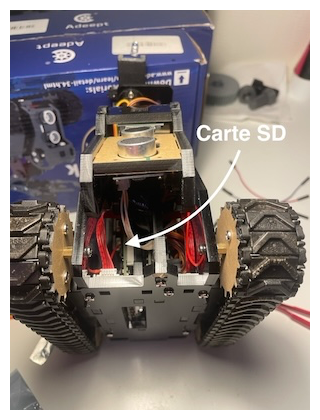
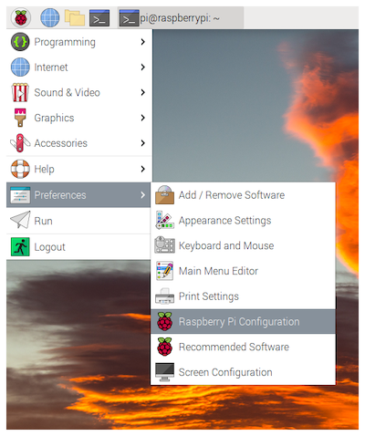
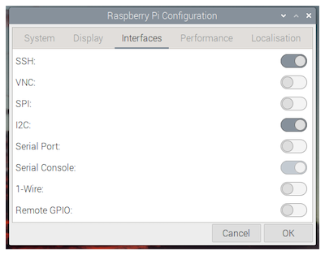

# Séance n°1

### Objectifs :
- Configuration du robot :
    - Installation de Raspberry Pi OS
    - Installation des librairies nécessaires au projet
- Mise en place de l'environnement de développement via SSH
- Programmer les fonctions de base (déplacement, contrôle des servos, des LEDs, …)

:warning: **Note** : Les "lessons" font référence aux tutoriels d'Adeept disponibles [ici](https://www.adeept.com/video/static1/itemsfile/901RaspTank%20Tutorials.zip), trouvables dans le dossier "*2 Basic course*"

## 1. Installation de Raspberry Pi OS

- Téléchargez [Raspberry Pi Imager](https://www.raspberrypi.com/software/)
- Flashez la carte SD :
    - Choose Device : Raspberry Pi 4  
    
    - Choose OS : Raspberry Pi OS (Legacy, 32-bit)  
    
    - Choose Storage :  
    
    - Ensuite, cliquez sur *Next* :
        - Would you like to apply OS customization settings? : No
        - All existing data on '...' will be erased? : Yes

- Insérez la carte SD dans le Raspberry Pi  


:white_check_mark: Vous pouvez maintenant allumer le Raspberry Pi en branchant l'alimentation et le câble HDMI.

## 2. Configuration du Raspberry Pi

- Ouvrez la configuration du Raspberry Pi  


- Activez l'I2C et le SSH  


:white_check_mark: Vous pouvez maintenant redémarrer le Raspberry Pi

## 3. Installation des librairies nécessaires au projet

:warning: Connectez-vous à un réseau Wi-Fi avant de poursuivre

1. Créez un environnement virtuel Python 3.8 nommé **"rasptank"**.

Pour ça, vous pouvez utiliser **conda**, **pyenv** ou compiler **Python 3.8** depuis les sources, car ce paquet n’est pas disponible dans les dépôts de **Debian 13** et une installation via `apt install python3.8` ne fonctionnera pas.


2. Activez l’environnement virtuel :

   * Si vous utilisez **venv** :

     ```bash
     source rasptank/bin/activate
     ```

   * Si vous utilisez **conda** :

     ```bash
     conda activate rasptank
     ```

3. Installez les bibliothèques qui se trouvent dans le fichier **requirements.txt** de ce dépôt Git :

   ```bash
   pip install -r requirements.txt
   ```


## 4. Mise en place de l'environnement de développement via SSH

:warning: Les réseaux `eduspot` et `edurom` isolent chaque appareil sur le réseau, rendant impossible la connexion SSH au Rasptank. Pour utiliser SSH, connectez-vous au réseau suivant :

SSID : `TP-Link_AC96`

Mot de passe : `51313296`

Ce réseau n'a pas d'accès à Internet :confused:. Vous pouvez également utiliser le partage de connexion de votre téléphone.

Si besoin, voir : [Remote Development using SSH](https://code.visualstudio.com/docs/remote/ssh)

**Note** : Assurez-vous d'activer le SSH sur le Raspberry Pi

## 5. Commencer à programmer

Vous pouvez maintenant commencer à programmer votre robot, pour cela inspirez-vous du code disponible dans les [tutoriels Adeept V2.0](https://www.adeept.com/learn/detail-34.html) pour chaque composant du robot :

- *Lesson 6 How to Control DC Motor*
- *Lesson 7 How to Control WS2812 LED*
- *Lesson 8 How to Control the Ultrasonic Module*
- *Lesson 13 How to Use the Tracking Module*

Pour les servos voir: [Adafruit CircuitPython PCA9685](https://github.com/adafruit/Adafruit_CircuitPython_PCA9685)

:information_source: Pour commencer à programmer le robot, il est recommandé de créer des fonctions de base afin de contrôler votre robot, telles que move(), enableLED(), etc. Cela vous permettra ensuite d'intégrer facilement la communication avec la télécommande. Par exemple, si le robot reçoit MoveLeft de la télécommande, alors il appelle move('Left').

Voici une liste des fonctionnalités que vous pouvez commencer à implémenter :

- Contrôler les moteurs pour les déplacements du robot.
- Pouvoir allumer les LEDs (quand vous vous faites tirer dessus).
- Détecter le passage d'une zone noire à une zone blanche, pour la zone de capture du drapeau.

Le but n'est pas de suivre chaque tutoriel à la lettre, mais plutôt de comprendre comment réaliser des actions spécifiques, comme allumer les LEDs d'une certaine couleur ou faire avancer le robot. Cela vous permettra de créer votre programme robot.py, qui sera le programme exécuté sur votre robot pour le contrôler.

:warning: Pour vous éviter de recopier le code des tutos à la main, vous pouvez trouver le code ici : [Github Adeept](https://github.com/adeept/Adeept_RaspTank/)