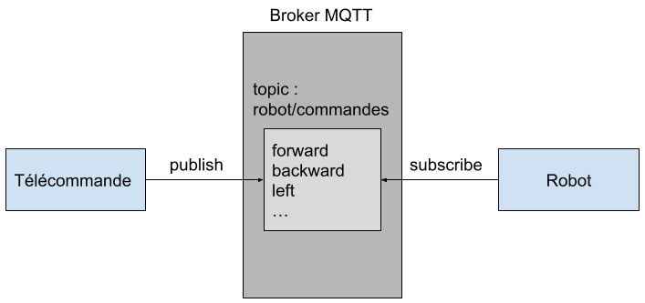
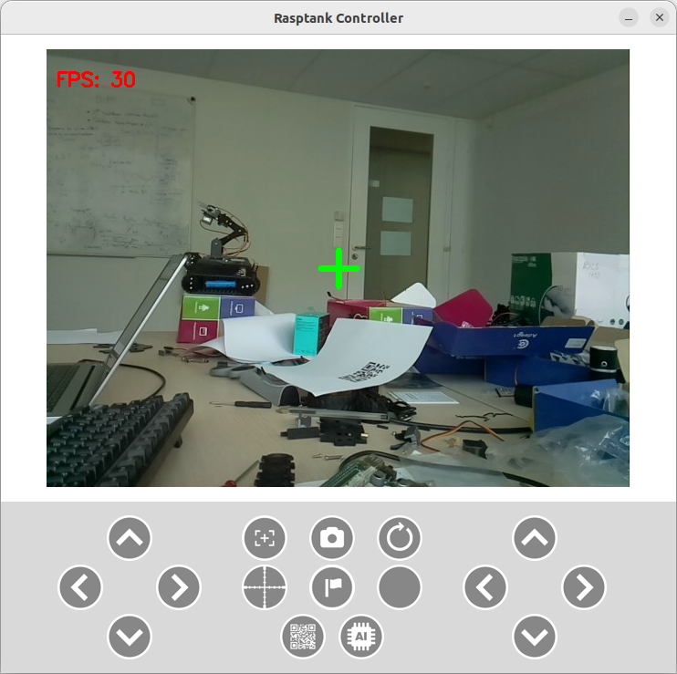

# Séance n°2

### Objectifs :
- Détection de la zone de capture via le module suiveur de ligne.
- Programmation de la télécommande.

## 1. Détection de la Zone de Capture

Le tracking module est équipé de trois capteurs : un à droite, un à gauche et un au centre. Chaque capteur peut détecter une intensité lumineuse, permettant ainsi de distinguer entre un sol clair et une ligne noire. L'idée est que le capteur central détecte la ligne noire, tandis que les capteurs latéraux détectent le sol clair. Si l'un des capteurs latéraux perçoit la ligne noire, cela signifie que le robot dévie de sa trajectoire. Par exemple, si le capteur gauche détecte la ligne noire, le robot ajustera sa direction en tournant légèrement à droite pour se recentrer par rapport à la ligne noire au sol.

Dans le cadre de ce projet, notre objectif principal est de détecter un changement d'intensité lumineuse, c'est-à-dire le passage du sol à une feuille blanche, qui représente la zone de capture du drapeau. Pour cela, nous utiliserons uniquement le capteur central. Lorsque ce dernier détecte un changement dans la valeur de l'intensité lumineuse reçue, signifiant l'entrée dans la zone de capture, un message sera envoyé au serveur.

Pour implémenter cette fonctionnalité, référez-vous au guide *Lesson 13 How to Use the Tracking Module*.

:information_source: Avant de vous lancer là-dedans, lisez la suite, notamment la partie sur le [*Polling vs Interruptions*](####polling-vs-interruptions).

## 2. Programmation de la Télécommande

Vous êtes totalement libre quant en ce qui concerne la télécommande, voici touts de même quelques idées.

## Liaison Télécommande - Robot

#### Communication via `socket`

Il est possible de créer une connexion TCP entre la télécommande et le robot. Par cette connexion, vous pouvez envoyer des commandes.

**Mots-clés** : *python socket tcp connection*

#### Communication via `MQTT` :star:

Autre possibilité, l'utilisation du protocole MQTT pour envoyer des commandes au robot. Dans ce cas, votre télécommande publie les commandes sur le topic `robot/commandes`. De son côté, votre robot s'abonne à ce topic pour recevoir les commandes.

:warning: Si vous utilisez le Broker MQTT du serveur central merci d'utiliser le topic suivant: tanks/**@_MAC_robot**/commands

*Exemple* : tanks/0xdca632bf91cc/commands

**Mots-clés** : *paho mqtt python send message*

:information_source: Le principe de MQTT est expliqué dans cette [vidéo](https://www.youtube.com/watch?v=kuyCd53AOtg) (7 premières minutes). La suite de la vidéo est un tutoriel pour apprendre à utiliser MQTT avec Python.

#### Polling vs Interruptions

:information_source: Je recommande fortement l'utilisation de **MQTT** car cela permet d'utiliser facilement les **interruptions**.

Il y a deux manières de recevoir une commande via le réseau :

1) **Polling** : On écoute en permanence pour vérifier si une commande est arrivée. Par exemple, toutes les secondes, le CPU interroge la carte réseau pour savoir si une commande est parvenue.

2) **Interruption** : Lorsque la carte réseau reçoit une commande, elle envoie immédiatement un message au CPU pour l'informer qu'une commande est arrivée.

Dans le cadre de notre projet, il est crucial que le robot réagisse immédiatement aux commandes. Avec le polling, si on vérifie toutes les secondes, il y aura environ une seconde de latence.

Vous pourriez penser à vérifier plus fréquemment, disons toutes les 100ms, mais cette approche a un coût. À chaque fois que le CPU interroge la carte réseau pour savoir si une commande est arrivée, il ne peut rien faire d'autre. Imaginez alors ce qui se passerait si, pendant cette interrogation, le robot entrait dans la zone de capture. Le robot ne détecterait pas son entrée dans la zone et, par conséquent, la capture du drapeau ne débuterait pas.

**TL;DR** : Les interruptions c'est cool, essayez toujours de les utiliser si vous le pouvez.

## Interface Graphique

### Une Première Version

:bulb: Il est recommandé dans un premier temps de commencer par une version simple sans interface graphique pour tester la communication entre le robot et la télécommande. Cela vous permettra de développer les fonctionnalités de base du robot (déplacement, tirs, ...) et de travailler en parallèle sur l'interface graphique de la télécommande.

### Quelques Idées

Voici une liste non exhaustive de bibliothèques graphiques pour créer votre télécommande :

#### Tkinter :star:

**Avantages** :
- Simple, beaucoup de documentation disponible.

**Inconvénients** :
- Pas adapté pour afficher de la vidéo, avec des performances limitées sur Raspberry 15-20 fps d'après mes tests.

:information_source: Sur un PC portable, Tkinter fonctionne bien pour la vidéo (30 fps) donc pas de soucis.

#### PyQt5

**Avantages** :
- Lecture de vidéo fluide sur Raspberry 45 fps constant d'après mes tests.

**Inconvénients** :
- Plus complexe à utiliser que Tkinter.

#### GTK (:warning: non testé)

**Avantages** :
- Probablement fluide pour la lecture vidéo sur Raspberr (c'est ce qui est utilisé par OpenCV).

**Inconvénients** :
- Plus complexe que Tkinter.

#### OpenCV

Une autre approche serait d'utiliser `imshow` d'OpenCV pour la vidéo et un autre programme avec par exemple Tkinter pour les boutons.

**Avantages** :
- Fluidité vidéo avec `imshow` et simplicité de Tkinter.

**Inconvénients** :
- Deux fenêtres distinctes.

#### Notes

Vous êtes entièrement libres pour la télécommande. Si vous souhaitez utiliser une manette de Playstation ou d'Xbox ou même votre téléphone, c'est possible.

:warning: Néanmoins, gardez à l'esprit que le projet est dense. Il est donc recommandé de finaliser la partie obligatoire avant d'implémenter des fonctionnalités supplémentaires ou de se lancer dans quelque choses de compliqué.
