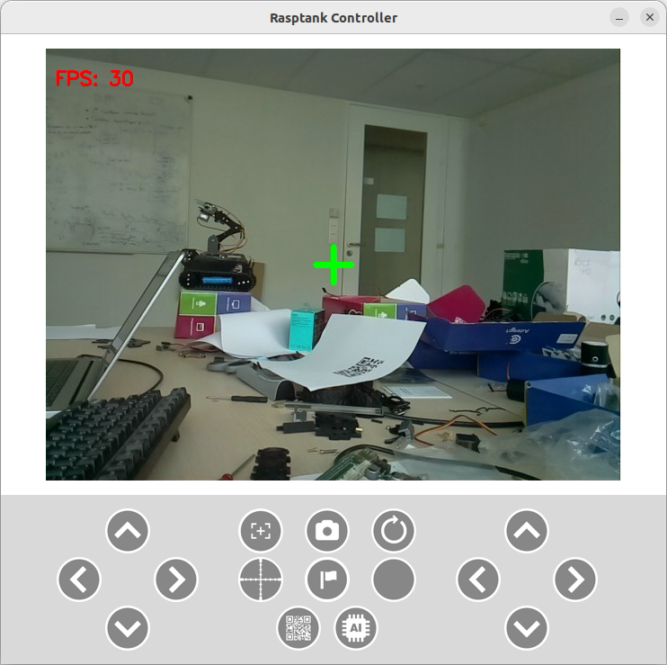

# Séance n°3

### Objectifs :
- Implémentation des fonctionnalités suivantes :
    - Émission de tirs infrarouges via une LED infrarouge.
    - Réception d'un tir via un récepteur infrarouge.
    - Détection de la zone de capture via le module suiveur de ligne.
- Programmation de la télécommande.

## Présentation de l'Infrarouge

Pour permettre au robot de tirer et de détecter les tirs adverses, nous utiliserons la technologie infrarouge. L'émission de tirs se fera au moyen d'un émetteur infrarouge, tandis que la détection des tirs ennemis sera assurée par un récepteur infrarouge. Cette technologie est similaire à celle utilisée dans les télécommandes de télévision.

### Comment Transmettre de l'Information ?

La transmission d'informations par la lumière se fait en allumant et éteignant la source lumineuse. On peut ainsi transmettre des informations suivant un protocole, à l'image du morse.

### La Porteuse

La méthode ci-dessus est sensible à toutes les sources d'infrarouge, y compris celles présentes dans notre environnement, comme le soleil. Ces sources peuvent perturber la transmission des messages émis par l'émetteur infrarouge.

Pour créer un canal de communication fiable entre l'émetteur et le récepteur, nous utilisons une porteuse. Dans notre cas, cette porteuse est une onde de fréquence 38kHz. Pour transmettre un message, nous modulons cette porteuse avec le signal correspondant au message.

Nous pouvons alors configurer notre récepteur pour qu'il "écoute" uniquement les ondes infrarouges de fréquence 38kHz.

### NEC

Avec un canal de communication établi, nous devons définir le protocole à utiliser. Le protocole choisi est le NEC, développé par la société éponyme dans les années 80 et aujourd'hui largement utilisé dans les télécommandes infrarouges.

Le protocole NEC emploie un codage par distance d'impulsion, où une impulsion signifie allumer la LED infrarouge pendant 562.5µs.

- Pour envoyer un "1" logique : allumez la LED infrarouge pendant 562.5µs, puis éteignez-la pendant 1687.5µs.
- Pour envoyer un "0" logique : allumez la LED infrarouge pendant 562.5µs, puis éteignez-la pendant 562.5µs.

Le protocole NEC définit également d'autres normes, mais nous ne les respecterons pas toutes dans le cadre de notre projet. Voici un exemple de trame NEC :

## 1. Émission de Tir

*Contenu à venir.*

## 2. Réception d'un Tir

*Contenu à venir.*

## 3. Détection de la Zone de Capture

*Contenu à venir.*

## 4. Programmation de la Télécommande

Vous êtes totalement libre quant en ce qui concerne la télécommande, voici touts de même quelques idées.

## Liaison Télécommande - Robot

#### Communication via `socket`

Il est possible de créer une connexion TCP entre la télécommande et le robot. Par cette connexion, vous pouvez envoyer des commandes.

**Mots-clés** : *python socket tcp connection*

#### Communication via `MQTT` :star:

Autre possibilité, l'utilisation du protocole MQTT pour envoyer des commandes au robot. Dans ce cas, votre télécommande publie les commandes sur le topic `robot/commandes`. De son côté, votre robot s'abonne à ce topic pour recevoir les commandes.

:warning: Si vous utilisez le Broker MQTT du serveur central merci d'utiliser le topic suivant: tanks/**@_MAC_robot**/commands

*Exemple* : tanks/0xdca632bf91cc/commands

**Mots-clés** : *paho mqtt python send message*

#### Polling vs Interruptions

Je recommande fortement l'utilisation de **MQTT** car cela permet d'utiliser les **interruptions**.

Il y a deux manières de recevoir une commande via le réseau :

1) **Polling** : On écoute en permanence pour vérifier si une commande est arrivée. Par exemple, toutes les secondes, le CPU interroge la carte réseau pour savoir si une commande est parvenue.

2) **Interruption** : Lorsque la carte réseau reçoit une commande, elle envoie immédiatement un message au CPU pour l'informer qu'une commande est arrivée.

Dans le cadre de notre projet, il est crucial que le robot réagisse immédiatement aux commandes. Avec le polling, si on vérifie toutes les secondes, il y aura environ une seconde de latence.

Vous pourriez penser à vérifier plus fréquemment, disons toutes les 100ms, mais cette approche a un coût. À chaque fois que le CPU interroge la carte réseau pour savoir si une commande est arrivée, il ne peut rien faire d'autre. Imaginez alors ce qui se passerait si, pendant cette interrogation, le robot entrait dans la zone de capture. Le robot ne détecterait pas son entrée dans la zone et, par conséquent, la capture du drapeau ne débuterait pas.

**TL;DR** : Les interruptions c'est cool, essayez toujours de les utiliser si vous le pouvez.

## Interface Graphique

### Une Première Version

:bulb: Je vous recommande dans un premier temps de commencer par une version simple sans interface graphique pour tester la communication entre le robot et la télécommande. Cela vous permettra de développer les fonctionnalités de base du robot (déplacement, tirs, ...) et de travailler en parallèle sur l'interface graphique de la télécommande.

### Quelques Idées

Voici une liste non exhaustive de bibliothèques graphiques pour créer votre télécommande :

#### Tkinter :star:

**Avantages** :
- Simple, beaucoup de documentation disponible.

**Inconvénients** :
- Pas adapté pour afficher de la vidéo, avec des performances limitées sur Raspberry 15-20 fps d'après mes tests.

:information_source: Sur un PC portable, Tkinter fonctionne bien pour la vidéo (30 fps) donc pas de soucis.

#### PyQt5

**Avantages** :
- Lecture de vidéo fluide sur Raspberry 45 fps constant d'après mes tests.

**Inconvénients** :
- Plus complexe à utiliser que Tkinter.

#### GTK (:warning: non testé)

**Avantages** :
- Probablement fluide pour la lecture vidéo sur Raspberr (c'est ce qui est utilisé par OpenCV).

**Inconvénients** :
- Plus complexe que Tkinter.

#### OpenCV

Une autre approche serait d'utiliser `imshow` d'OpenCV pour la vidéo et un autre programme avec par exemple Tkinter pour les boutons.

**Avantages** :
- Fluidité vidéo avec `imshow` et simplicité de Tkinter.

**Inconvénients** :
- Deux fenêtres distinctes.

#### Notes

Vous êtes entièrement libres pour la télécommande. Si vous souhaitez utiliser une manette de Playstation ou d'Xbox ou même votre téléphone, c'est possible.

:warning: Néanmoins, gardez à l'esprit que le projet est dense. Il est donc recommandé de finaliser la partie obligatoire avant d'implémenter des fonctionnalités supplémentaires ou de se lancer dans quelque choses de compliqué.
