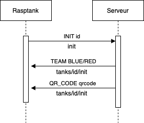
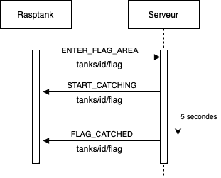
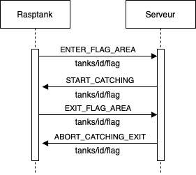
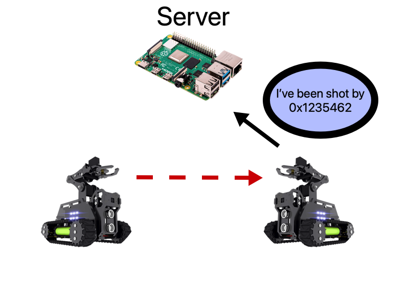
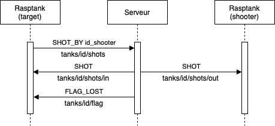

# Séance n°4

### Objectifs :
- Communication avec le serveur central via MQTT

## 1. Communication avec le serveur central

Afin de pouvoir participer à une partie de *World of Rasptank*, vous devez communiquer avec le serveur central. Ce dernier agit comme le maître de jeu, indiquant par exemple que vous avez touché un adversaire, capturé le drapeau, etc. La communication avec ce serveur est définie par un protocole détaillé dans ci-dessous.

### Initialisation

Le premier message à envoyer au serveur est "INIT", qui permet au serveur d'enregistrer votre robot dans la partie et de vous attribuer une équipe.



Dans ce diagramme, le texte sous les flèches indique le topic MQTT utilisé pour envoyer le message. "id" représente l'adresse MAC du robot, voici comment l'obtenir en python :

```python
import  uuid
tankID  =  uuid.getnode()
```

### Flag Area

Lorsque votre robot entre dans la zone de capture du drapeau, vous devez envoyer un message au serveur.



Si le drapeau est disponible, le serveur répondra `START_CATCHING` (comme dans l'exemple). Si vous avez déjà capturé le drapeau, il répondra `ALREADY_GOT` et si un autre robot l'a déjà capturé, la réponse sera `NOT_ONBASE`.

Si vous quittez la zone de capture avant la fin du temps (5 secondes), le serveur vous enverra `ABORT_CATCHING_EXIT`.



### Shots

Les robots se tirent dessus entre eux via un émetteur infrarouge. Lorsqu'un robot "tire" sur un autre, en réalité, il lui envoie son `id` via l'infrarouge. Le robot touché par le tir peut donc connaître l'identité du tireur en lisant le message qu'il a reçu via son récepteur infrarouge.



Le robot touché doit informer le serveur qu'il a été touché. Il envoie pour cela le message `SHOT_BY id_shooter` sur le topic `tanks/id/shots`.



Après avoir reçu `SHOT_BY`, le serveur vérifie l'identité du tireur. Si ce dernier est dans l'équipe adverse, le tireur recevra `SHOT` sur `tanks/id/shots/out` et le robot touché recevra le même message sur `tanks/id/shots/in`. Si le robot touché est de la même équipe, le message reçu par le tireur sera `FRIENDLY_FIRE`.

Si le robot touché possédait le drapeau, il recevra `FLAG_LOST`. S'il était en train de capturer le drapeau, il recevra `ABORT_CATCHING_SHOT`.

### Flag deposit

Pour ramener le drapeau à sa base, le roboto doit scanner le QR code et l'envoyer au serveur.


Si le QR code est correct, le serveur répondra `SCAN_SUCCESSFUL`, sinon `SCAN_FAILED`. Si vous aviez le drapeau au moment du scan, vous recevrez `FLAG_DEPOSITED`, sinon `NO_FLAG`. Si c'est le 3ème drapeau déposé dans votre base, le serveur enverra à tous les participants le message `WIN BLUE` ou `WIN RED` sur le topic `tanks/id/flag`, indiquant l'équipe gagnante.