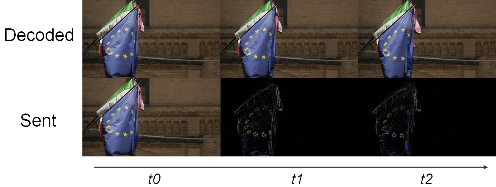
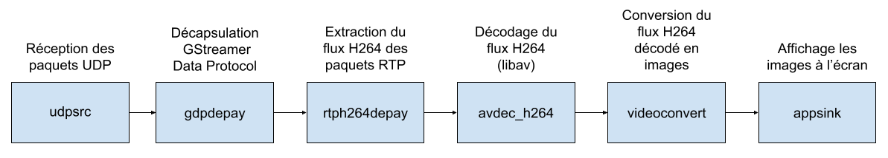
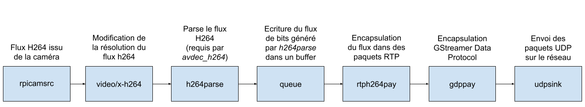

# Séance n°5

### Objectifs :
- Streaming de la caméra

:warning: Il est conseillé d'avoir implémenté l'ensemble des fonctionnalités avant de s'attaquer au streaming vidéo.

## 1. Streaming Vidéo

### Introduction : Les Problèmes Liés à la Vidéo

Il existe deux manières de streamer de la vidéo :

1. **MJPEG**

MJPEG, pour Motion JPEG, consiste à prendre des photos et à les envoyer les unes après les autres pour créer une vidéo. Cependant, ce procédé consomme beaucoup de bande passante.

- Une image JPEG non compressée fait entre quelques centaines de KB et peut atteindre le MB. Pour notre exemple, prenons une taille moyenne de 500 KB par image JPEG. Un stream à 30 fps (frames per second) consommerait donc 500 x 30 x 8 (pour passer en bits) = 120 Mbps, soit plus du double de la bande passante moyenne en France, qui est de 51 Mbps par habitation (en 2021).

- En compressant nos images JPEG à une qualité de 50% (compression nettement visible), on peut réduire la taille moyenne de nos images à 32 KB. Un stream à 30 fps consommerait alors 32 x 30 x 8 = 7.6 Mbps.

7.6 Mbps pour de la 480p est considérable. Pour comparaison, une vidéo YouTube en 1080p consomme environ 5 Mbps, alors qu'une image en 1080p contient 6.75 fois plus de pixels qu'une en 480p. 

Cette solution n'est donc pas viable. Avec plusieurs robots, on saturerait rapidement la bande passante du routeur (entre 72 et 150 Mbps). De plus, une forte charge sur le réseau créerait de la latence, ce que nous souhaitons éviter. Notre projet devant être scalable, une autre solution doit être trouvée.

2. **Codec Vidéo**

La solution est d'utiliser un codec vidéo pour la compression. C'est grâce à ce type de codec qu'une vidéo YouTube en 1080p ne consomme "que" 5 Mbps. Un codec vidéo est un dispositif (matériel ou logiciel) qui encode et décode de la vidéo selon une norme spécifique (codec vient de **coder-decoder**). Par exemple, **H264** est une norme vidéo et **x264** est un codec (logiciel) capable d'encoder ou de décoder un flux vidéo dans le format décrit par la norme H264. Nous utiliserons notamment libav, un autre codec H264. 

###### Problème de Ressources ?

Il existe des composants matériels, conçus spécifiquement pour encoder/décoder un flux d'une certaine norme. Ces composants sont très rapides et se retrouvent dans des équipements comme les box TV. Cependant, le Raspberry Pi n'en possède pas, donc nous utiliserons un codec logiciel, qui s'exécute sur le CPU du Raspberry. Ce dernier n'étant pas spécialement conçu pour le décodage H264, il est moins rapide. Heureusement, grâce aux optimisations logicielles, le Raspberry peut décoder et afficher un flux H264 en 480p à 30 fps.

###### Principe

Comment une vidéo YouTube en 1080p ne consomme-t-elle "que" 5 Mbps ? C'est grâce à la compression introduite par la norme H264. En plus de la compression spatiale (réduction de la qualité d'image), le H264 utilise la compression temporelle. Voici un exemple :

- *t0* : On envoie l'image complète.
- *t1* : On envoie seulement les pixels ayant changé par rapport à *t0*.
- *t2* : On envoie seulement les pixels ayant changé par rapport à *t0*.
- *t3* : On envoie une nouvelle image complète.
- etc...



Cette technique réduit considérablement la bande passante si l'image ne change pas souvent. La norme H264 utilise des techniques de compression plus avancées. Pour plus de détails sur ces techniques, consultez la page Wikipédia dédiée à la norme H264.

## Implémentation

Si vous souhaitez implémenter le streaming mais que vous ne vous sentez pas à l'aise avec le codec (voir la suite du tutoriel), vous pouvez opter pour la première méthode. Les tutoriels disponibles sur Internet utilisent cette méthode. 
:warning: Si vous choisissez cette option, assurez-vous de pouvoir activer ou couper le stream.

Vous pouvez également le faire "correctement" en suivant le tutoriel ci-dessous.
:warning: Cela peut être long et fastidieux, et il y a des risques que vous cassiez votre installation Python. Si vous choisissez cette voie, n'hésitez pas à faire une sauvegarde complète de la carte SD avant de commencer, afin de ne pas perdre de temps si vous fâites des bétises

### Via le Codec H264

Dans l'introduction, j'ai mentionné les optimisations du logiciel de streaming qui nous permettent de streamer un flux H264 d'un Raspberry Pi à un autre. Ce logiciel, c'est **GStreamer**.

#### GStreamer

GStreamer offre de nombreuses fonctionnalités liées au streaming vidéo. Voici celles que nous utiliserons :

- Encoder un flux H264 (ou peut-être pas, voir la suite).
- Envoyer le flux H264 via le protocole UDP.
- Recevoir les paquets UDP.
- Décoder le flux H264.
- Afficher la vidéo issue du flux H264 décodé.

GStreamer fonctionne sur le principe de pipeline, permettant de lier de nombreux "éléments" pour créer des workflows complexes, comme dans notre cas la réception, le décodage et l'affichage d'un flux H264.

:information_source: Chaque élément du pipeline est séparé par un `!`.

Voici un résumé général d'un pipeline GStreamer :


##### Réception du Stream (Télécommande)

Commande GStreamer à exécuter sur la télécommande :

```python
udpsrc port=5000 ! gdpdepay ! rtph264depay ! avdec_h264 ! videoconvert ! appsink sync=false
```

Pipeline correspondant à cette commande :



##### Émission du Stream (Robot)

Commande GStreamer à exécuter sur le robot :

```python
rpicamsrc bitrate=6000000 ! video/x-h264,width=640,height=480 ! h264parse ! queue ! rtph264pay config-interval=1 pt=96 ! gdppay ! udpsink host=10.3.141.138 port=5000
```

Pipeline correspondant à cette commande :



:information_source: Vous avez peut-être remarqué que dans le pipeline de réception, on mentionne le décodage du flux H264 (via *avdec_h264*), alors que dans le pipeline d'émission, l'encodage du flux H264 n'est pas explicité.

Ceci est dû au fait que le flux capturé par la caméra (via *rpicamsrc*) est déjà en H264. Cela est permis par la caméra elle-même, qui contient un composant électronique transformant les données brutes de la caméra en un flux H264, un peu comme un mini encodeur H264 (bien que ce n'en soit pas vraiment un). Si le flux sortant de la caméra n'était pas déjà encodé en H264, il aurait fallu utiliser un encodeur logiciel, ce qui aurait introduit de la latence dans le streaming vidéo sur le Raspberry Pi.

:warning: Il est très important de toujours lancer d'abord la réception, puis l'émission du stream. Dans le cas contraire, cela ne fonctionnera pas et GStreamer renverra une erreur.

### Installation

Pour utiliser **GStreamer** et **rpicamsrc**, il est nécessaire de les installer. Vous devez installer GStreamer sur la télécommande et le robot, et rpicamsrc uniquement sur le robot.

#### Installation de GStreamer

```console
sudo apt-get install libx264-dev libjpeg-dev
sudo apt-get install gstreamer1.0-tools
```

Pour vérifier que *GStreamer* est bien installé :

```console
gst-launch-1.0 videotestsrc ! videoconvert ! autovideosink
```


#### Installation de rpicamsrc

```console
git clone https://github.com/thaytan/gst-rpicamsrc.git
cd gst-rpicamsrc
./autogen.sh
make
sudo make install
sudo ldconfig
```

Pour vérifier que *rpicamsrc* est bien installé :

```console
gst-inspect-1.0 rpicamsrc
```


#### Intégration de GStreamer dans OpenCV

Vous devriez maintenant être capable de streamer la caméra de votre robot vers votre télécommande avec les commandes fournies plus haut dans ce guide.


Pour effectuer du traitement sur la vidéo, tel que la lecture de QR Code, il est nécessaire de récupérer le flux vidéo directement dans OpenCV. **OpenCV** (pour Open Computer Vision) est une bibliothèque Python dédiée au traitement d'image et à la vision par ordinateur.

Pour permettre à OpenCV de lire le flux vidéo généré par GStreamer, il faut recompiler OpenCV en incluant GStreamer (uniquement pour la télécommande).

##### Recompiler OpenCV avec GStreamer

Il est vivement conseillé de créer un environnement virtuel Python avant de commencer. Cela évitera la nécessité de réinstaller votre OS en cas d'erreurs avec l'environnement Python.

###### Création d'un Environnement Virtuel Python

Utilisez Python 3.7 pour des raisons de compatibilité. Si votre télécommande est un Raspberry, Python 3.7 est normalement le Python par défaut. Sinon, voici comment l'installer :

```console
sudo apt update
sudo apt install software-properties-common
sudo add-apt-repository ppa:deadsnakes/ppa
sudo apt update
sudo apt install python3.7 python3.7-dev python3.7-venv
```

Créez l'environnement virtuel :

```console
python3.7 -m venv controller
source controller/bin/activate
```

Pour vérifier que vous êtes dans un environnement virtuel :

```console
python -c "import sys; print(sys.prefix)"
```

Vous devriez voir quelque chose comme ceci (où *controller* est le nom de votre environnement virtuel) :


###### Bibliothèques Nécessaires pour la Compilation

Installez *CMake* :

```console
sudo apt install cmake
```

Installez les bibliothèques de développement GStreamer :

```console
sudo apt install libgstreamer1.0-dev libgstreamer-plugins-base1.0-dev
```

Installez les bibliothèques graphiques requises (sinon OpenCV ne pourra pas afficher de vidéo) :

```console
sudo apt install libgtk2.0-dev
sudo apt install pkg-config
```

Enfin, installez *numpy* :

```console
pip install numpy
```

:warning: Assurez-vous d'être dans votre environnement virtuel.

###### Compilation d'OpenCV

Commencez par télécharger les sources d'OpenCV depuis leur dépôt GitHub.

```console
git clone https://github.com/opencv/opencv.git
cd opencv/
git checkout 4.1.0
```

Préparez ensuite la compilation d'OpenCV en spécifiant les options de compilation via des flags. Par exemple, indiquez le chemin de l'exécutable Python pour lequel vous souhaitez compiler et installer OpenCV. Grâce à ces flags, vous pouvez activer des options comme GStreamer, ce qui permettra à OpenCV de se compiler en incluant GStreamer.

```console
mkdir build
cd build
cmake -D CMAKE_BUILD_TYPE=RELEASE \
-D INSTALL_PYTHON_EXAMPLES=ON \
-D INSTALL_C_EXAMPLES=OFF \
-D PYTHON_EXECUTABLE=$(which python3) \
-D BUILD_opencv_python2=OFF \
-D CMAKE_INSTALL_PREFIX=$(python3 -c "import sys; print(sys.prefix)") \
-D PYTHON3_EXECUTABLE=$(which python3) \
-D PYTHON3_INCLUDE_DIR=$(python3 -c "from distutils.sysconfig import get_python_inc; print(get_python_inc())") \
-D PYTHON3_PACKAGES_PATH=$(python3 -c "from distutils.sysconfig import get_python_lib; print(get_python_lib())") \
-D WITH_GSTREAMER=ON \
-D BUILD_EXAMPLES=ON ..
```

Avant de continuer, vérifiez les points suivants dans les logs :

1. GTK+ est bien détecté :white_check_mark:
2. GStreamer est bien détecté :white_check_mark:
3. Le chemin de l'interpréteur Python est correct (votre environnement virtuel) :white_check_mark:


Une fois ces vérifications effectuées, lancez la compilation (cela peut prendre un certain temps).

```console
sudo make -j$(nproc)
```


###### Installation de Votre Version d'OpenCV

```console
sudo make install
sudo ldconfig
```

Pour vérifier que OpenCV est bien installé :

```console
python3 -c "import cv2; print(cv2.getBuildInformation())"
```

Une fenêtre de logs similaire à celle précédente s'ouvrira. Vérifiez à nouveau les mêmes trois points.

###### Utiliser GStreamer dans OpenCV

Après la compilation et l'installation, vous devriez être capable de lire un flux H264 décodé par GStreamer dans OpenCV avec le code suivant :

```python
import numpy as np
import cv2

cap = cv2.VideoCapture("gst-launch-1.0 udpsrc port=5000 ! gdpdepay ! rtph264depay ! h264parse ! avdec_h264 ! autovideosink sync=false", cv2.CAP_GSTREAMER)

while cap.isOpened():
    ret, frame = cap.read()
    if not ret:
        print('Error')
        continue

    cv2.imshow('Stream', frame)
    if cv2.waitKey(1) & 0xFF == ord('q'):
        break

cap.release()
```

:bulb: Pour l'émission, utilisez la ligne de commande présentée précédemment.

#### Lancer GStreamer avec Python

Pour lancer le streaming, nous utilisons GStreamer depuis le terminal. Cependant, pour notre robot, nous voulons qu'il démarre le streaming lorsque le programme Python du robot est lancé. On pourrait utiliser la commande suivante :

```python
os.system("gst-launch-1.0 ...")
```

Le problème avec cette méthode est que le streaming ne s'arrête pas lorsque l'on arrête le programme du robot. Pour résoudre ce problème, nous allons interagir directement avec GStreamer depuis notre programme Python.

Importer GStreamer :

```python
import gi 
gi.require_version('Gst', '1.0')
from gi.repository import Gst, GLib
```

Initialisation de GStreamer :

```python
Gst.init()
```

Création du Thread GStreamer :

```python
videoStream = GLib.MainLoop()
videoStreamThread = threading.Thread(target=videoStream.run)
videoStreamThread.start()
```

Pipeline GStreamer :

```python
pipeline = Gst.parse_launch("rpicamsrc bitrate=6000000 ! video/x-h264,width=640,height=480 ! h264parse ! queue ! rtph264pay config-interval=1 pt=96 ! gdppay ! udpsink host=X.X.X.X port=5000")
```

Lancer GStreamer :

```python
pipeline.set_state(Gst.State.PLAYING)
```

Arrêter le streaming :

```python
pipeline.set_state(Gst.State.NULL)
videoStream.quit()
videoStreamThread.join()
```

Voilà, vous pouvez maintenant lancer un stream avec GStreamer depuis un script Python.