# Guide : Montage du robot

Un tutoriel détaillé sur le montage du robot est disponible sur le site d'[Adeept](https://www.adeept.com/learn/detail-34.html).

Dans ce guide, on va se focaliser sur la conception du support de l'émetteur infrarouge, le montage du support ainsi que le câblage de l'émetteur et du récepteur.

## Conception du support de l'émetteur IR

1. Créez la sketch de la base (rectangle de 36x31 mm)

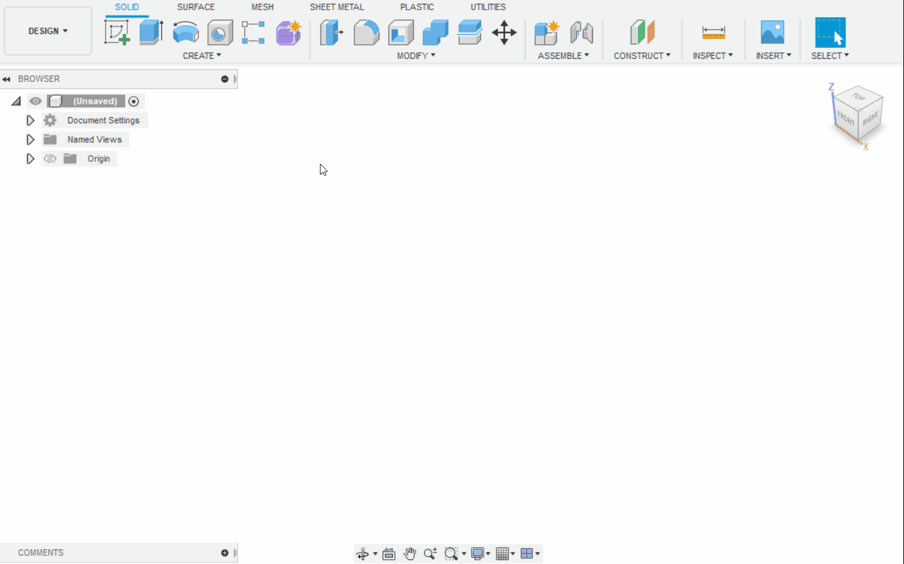

2. Donnez du volume à ce rectangle (3 mm)

3. Créez le le sketch suivant (21x3 mm)

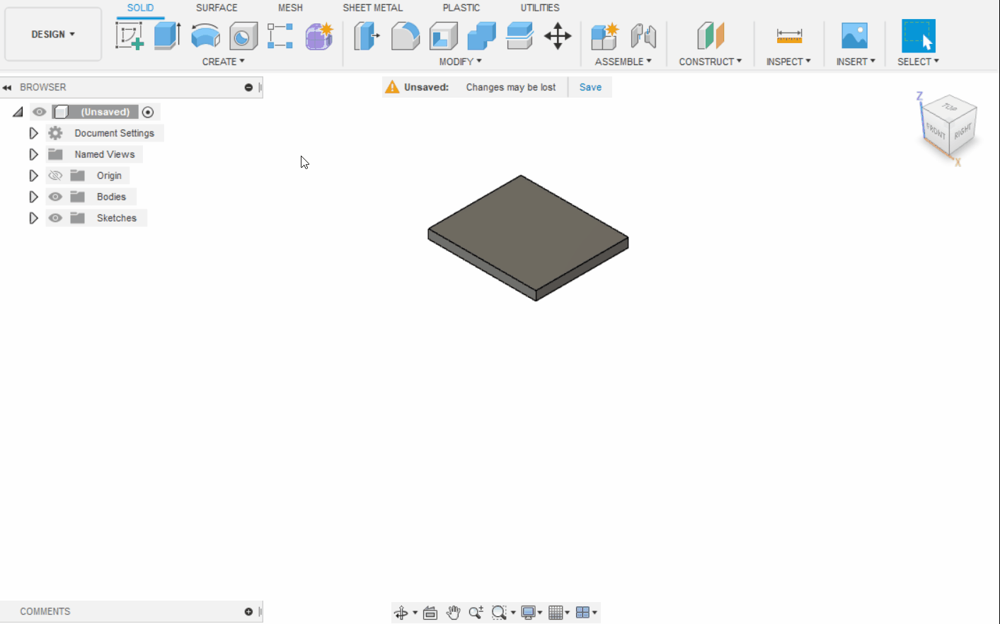

4. Extrudez négativement le sketch afin de le "creuser" (8 mm)

5. Créez le sketch suivant (21x4 mm)

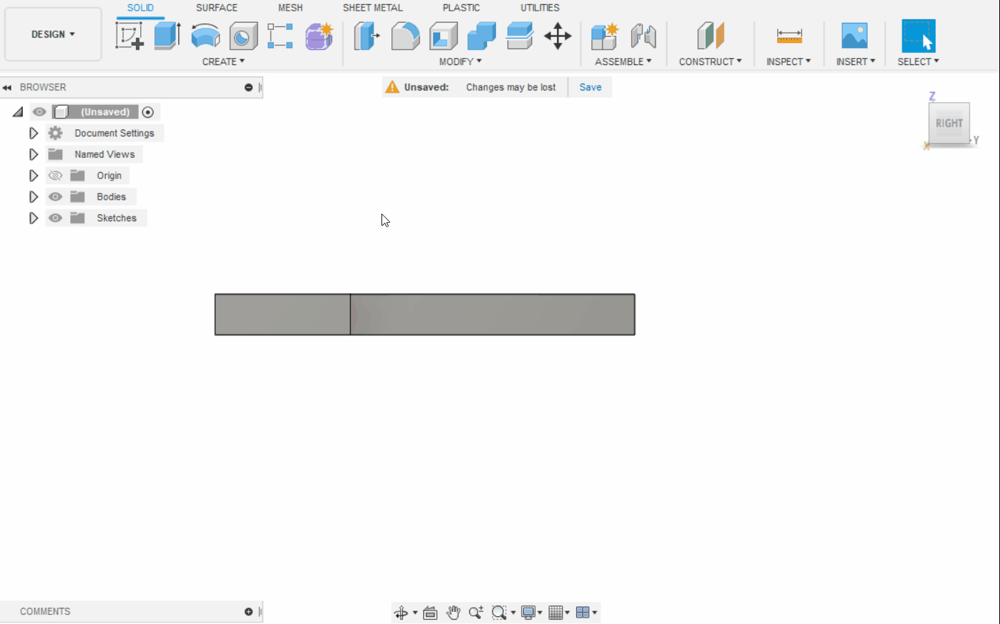

6. Extrudez le sketch (6 mm)

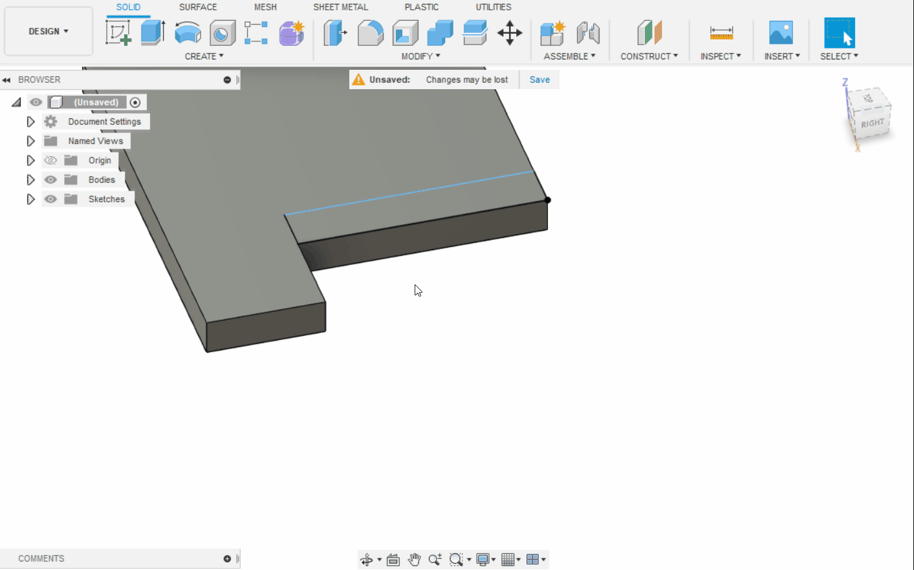

7. Créez le sketch suivant (19x2 mm)

8. Extrudez négativement le sketch (2 mm)

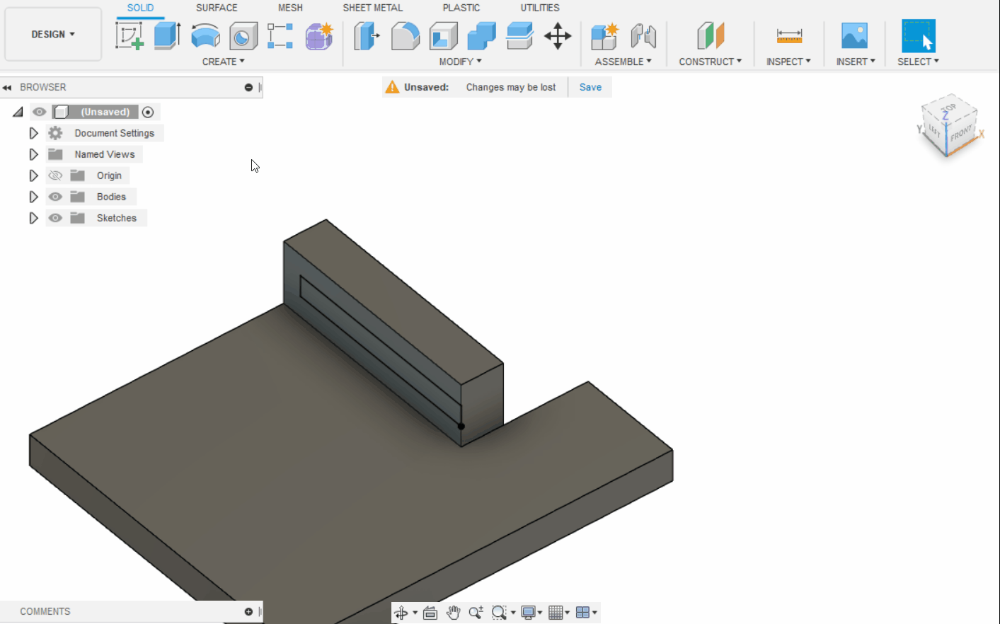

9. Faites la même chose de l'autre coté

10. Créez le sketch du trou qui accueillera la vis de fixation du servo

11. Extrudez

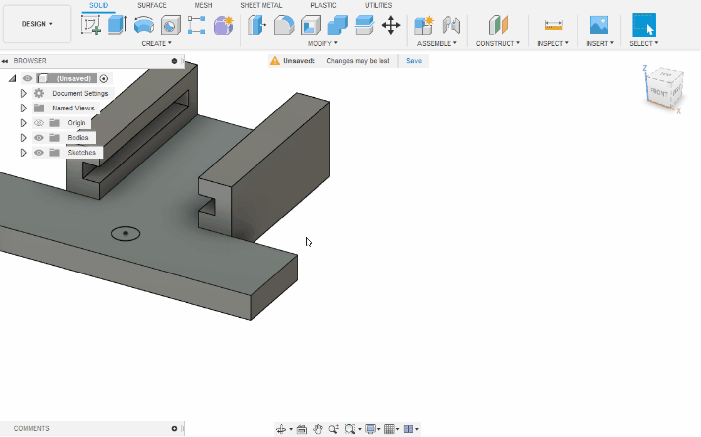

12. Créez le sketch du trou de la vis de fixation latéral droite

13. Extrudez

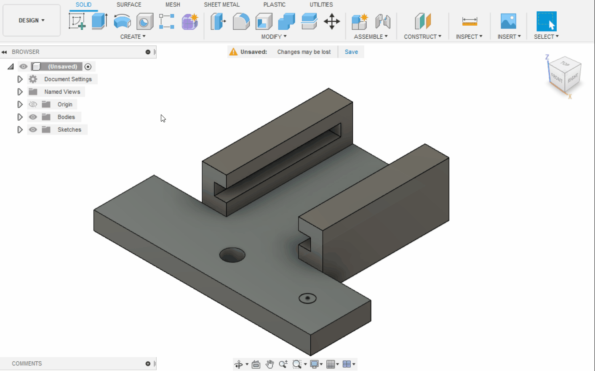

14. Faites la même chose pour le coté gauche

15. Arrondissez le coin inférieur droit

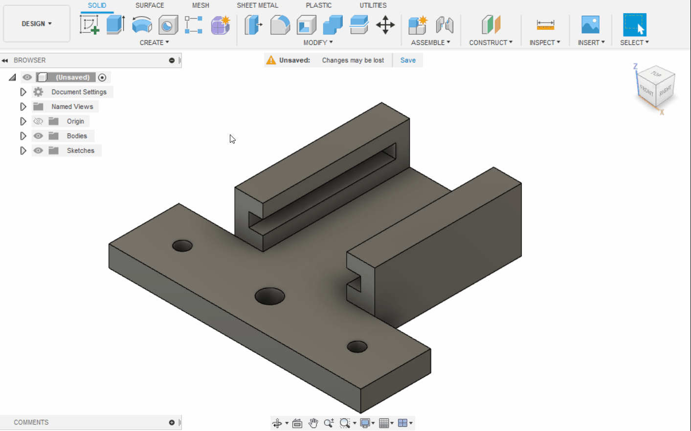

15. Faites la même chose pour les autres coins

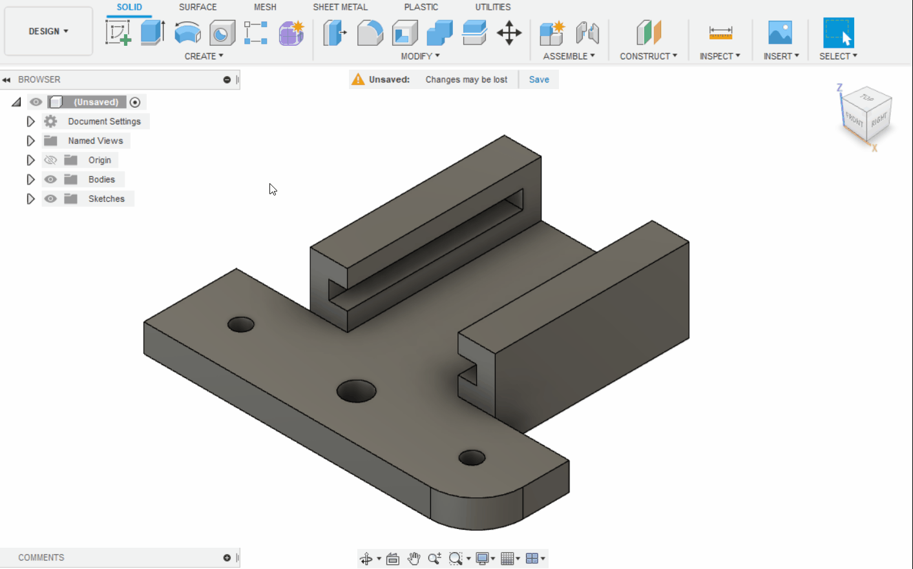

## Impression du support de l'émetteur IR

1. Voilà, votre pièce est terminé, il ne reste plus qu'à l'imprimer. Pour cela il faut dans un premier temps exporter la pièce dans un fichier STL.

2. Importez le fichier STL dans PrusaSlicer

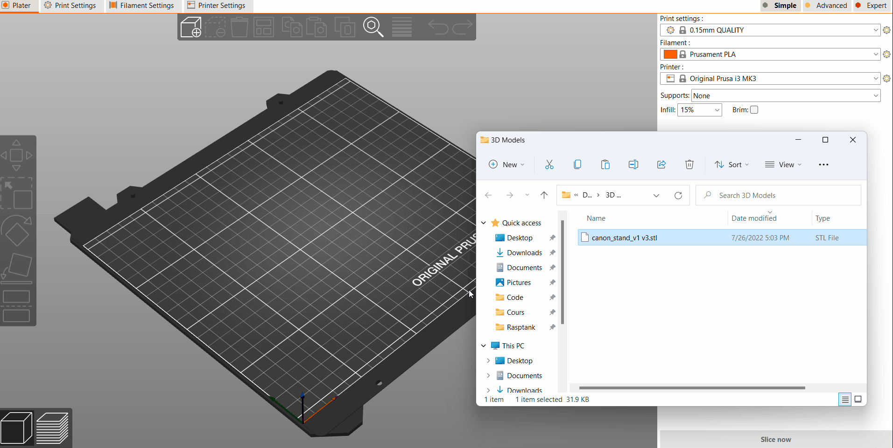

3. Slicez l'objet 3D et enregistrer le fichier G-code sur votre carte SD

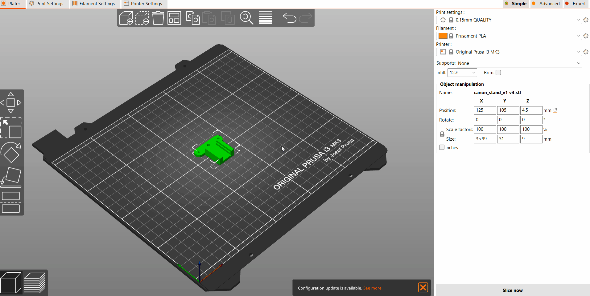

4. Vous pouvez maintenant imprimer votre support

## Montage du support de l'émetteur IR

Pour monter le support, il suffit de le mettre à l'emplacement de la pince comme sur la photo si dessous.

## Câblage de l'émetteur

Voici le détail de la connectique de l'émetteur et du récepteur infrarouge.

On va connecter le 5V et la masse (GND) sur les pins 5V et GND réservés aux servos. Les pins *signal* vont quant à eux être connecté à des pins GPIO du Raspberry.  

Le problème, c'est qu'on n'a pas directement accès au GPIO puisqu'ils sont tous utilisés par le *Motor Hat V2*, on va donc devoir ruser un petit peu. On va utiliser les connectiques RGB présentes sur le *Motor Hat V2* qui ne sont pas utilisées dans le cadre de notre projet afin d'y connecter l'émetteur et le récepteur infrarouge.

Voici le schéma du montage final

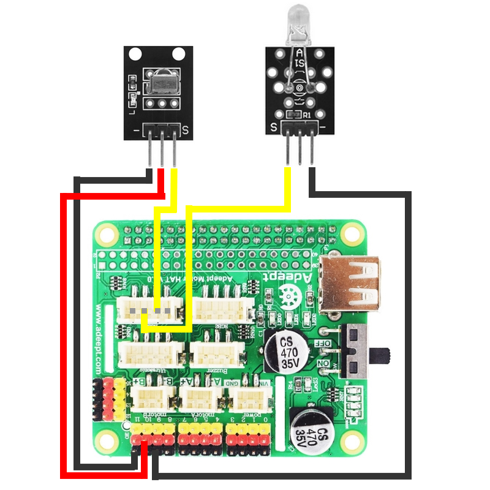

:information_source: Le GPIO sur lequel est connecté le récepteur est le GPIO 23 et celui sur lequel est connecté l'émetteur est le GPIO 22. Vous pouvez inverser les deux si vous voulez, mais souvenez vous de la manière dont vous les branchez, car vous aurez besoin dans le code plus tard.
