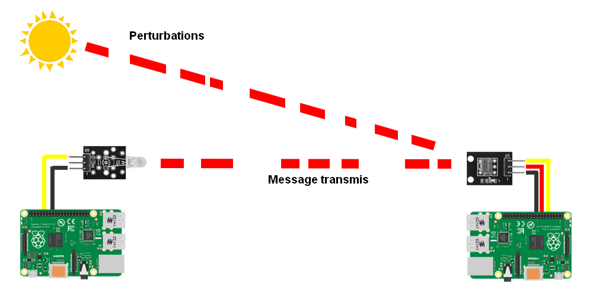

# Guide : L'infrarouge

Afin de donner au robot la possibilité de tirer et se faire tirer dessus, on va utiliser l'infrarouge. On va donc pour tirer utiliser un émetteur infrarouge et pour détecter les tirs ennemi, utiliser un récepteur infrarouge. C'est la même technologie qui est utilisée dans les télécommandes TV par exemple.

## Comment transmettre de l'information ?

Pour transmettre de l'information avec de la lumière, il suffit de l'allumer puis de l'éteindre, on peut alors transmettre de l'information selon un protocole comme le morse par exemple.

### La porteuse

Le problème de la méthode décrite ci-dessus, c'est qu'elle est sensible à tous les rayons infrarouges. En effet, il existe de très nombreuses sources de lumière infrarouge dans notre environnement, la plus évidente étant le soleil. Ces sources extérieures de lumière infrarouge sont elle aussi captées par le récepteur infrarouge, et cela perturbe la transmission du message émit par l'émetteur infrarouge.

On aimerait donc que le récepteur ne reçoivent que la lumière infrarouge émise par l'émetteur, afin de créer un canal de communication entre l'émetteur et le récepteur.

Cela est rendu possible par l'utilisation d'une porteuse. Dans notre cas, la porteuse est une onde ayant une fréquence de 38kHz. Afin de transmettre un message, on va maintenant utiliser cette porteuse que l'on va moduler avec le signal correspondant au message que l'on veut transmettre.

Maintenant on peut dire à notre récepteur "d'écouter" seulement les ondes infrarouge qui ont une fréquence de 38kHz.

### NEC

Maintenant, que l'on a un canal de communication, il faut que l'on définisse le protocole que l'on va utiliser pour cette communication. Ce protocole, c'est NEC, il a été inventé par la société du même nom dans les années 80. C'est aujourd'hui le protocole le plus utilisé par les télécommandes infrarouge.

Le protocole NEC utilise un codage par distance d'impulsion, une impulsion correspond à allumer la LED infrarouge pendant 562.5µs.

- Pour envoyer un 1 logique, il faut allumer la LED infrarouge pendant 562.5µs puis l'éteindre pour une durée de 1687.5µs.

- Pour envoyer un 0 logique, il faut allumer la LED infrarouge pendant 562.5µs puis l'éteindre pour une durée de 562.5µs

Le protocole NEC défini aussi d'autres normes qu'on ne va pas respecter dans le cadre de notre projet, voici un exemple de trame NEC.

### Code de Hamming

## Implémentation
