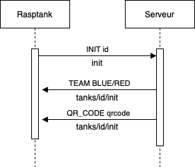
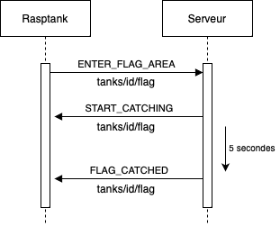
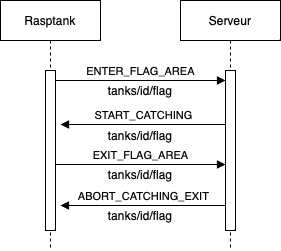
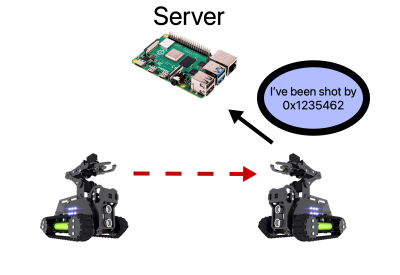
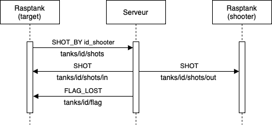
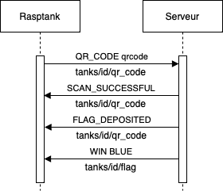

# Protocle Rasptank

Afin de pouvoir faire une partie de "World of Rasptank", vous devez communiquer avec le serveur central, celui-ci fait office de maître du jeu, c'est lui qui vous indique par exemple que vous avez touché un adversaire, capturer le drapeau, etc...

La communication avec ce serveur est définie par un protocole qui est détaillé dans ce guide.

## Initialisation

Le premier message à envoyer au serveur est le message "INIT", celui-ci permet au serveur d'enregistrer votre robot dans la partie, le serveur vous attribue ensuite une équipe.



Dans ce digramme, le texte en dessous des flèches correspond au topic mqtt sur lequel est envoyé le message

"id" correspond à l'adresse Mac du robot, voici comment la récupérer en python 
```python
import  uuid
tankID  =  uuid.getnode()
```

## Flag Area

Lorsque votre robot entre dans la zone de capture de drapeau, vous devez envoyer un message au serveur.



Si le drapeau est disponible à la capture, alors le serveur réponds `START_CATCHING` (comme dans l'exemple), si vous avez déjà capturé le drapeau, le serveur répondra `ALREADY_GOT` et si un autre robot a déjà capturé le drapeau, le serveur répondra `NOT_ONBASE`.

Si vous quittez la zone de capture avant la fin du temps (5 secondes) alors le serveur vous enverra `ABORT_CATCHING_EXIT`



## Shots

Les robots se tirent dessus entre eux via un émetteur infrarouge, lorsqu'un robot "tire" sur un autre en réalité il lui envoie son `id` via l'infrarouge. Le robot touché par le tir peut donc connaître l'identité du tireur en lisant le message qu'il a reçu via son récepteur infrarouge.




C'est le robot touché par le tire qui doit indiquer au serveur qu'il s'est fait tirer dessus. Pour cela il envoie le message `SHOT_BY id_shooter` sur le topic `tanks/id/shots`.



Après avoir reçu `SHOT_BY` le serveur fait des vérifications sur l'identité du tireur, si celui-ci est dans l'équipe adverse, le tireur recevra le message `SHOT` sur le topic `tanks/id/shots/out` et le robot touché recevra le même message sur le topic `tanks/id/shots/in`. 

Si le robot touché est un robot allié, le tireur recevra le message `FRIENDLY_FIRE` sur le topic `tanks/id/shots/out`.

Enfin si le robot touché possédait le drapeau, le drapeau sera perdu et il recevra le message `FLAG_LOST`, si par contre il était en train de capturer le drapeau, il recevra `ABORT_CATCHING_SHOT`.

## Flag deposit

Afin de ramener le drapeau à sa base, il faut scanner un qr code et l'envoyer au serveur.



Si le qr code envoyé au serveur est correct, le serveur répondra avec `SCAN_SUCCESSFUL`, sinon, il répondra avec `SCAN_FAILED`.

Ensuite, si vous possédiez le drapeau au moment du scan, le serveur vous enverra `FLAG_DEPOSITED`, sinon il enverra `NO_FLAG`

Enfin, si c'est le 3ème drapeau déposé dans votre base le serveur enverra à tous les participants sur le topic `tanks/id/flag` le message `WIN BLUE` ou `WIN RED` en fonction de l'équipe gagnante.


