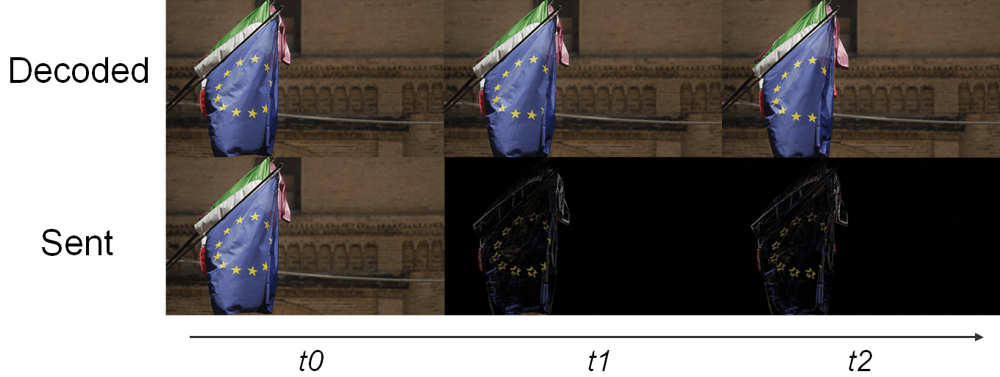
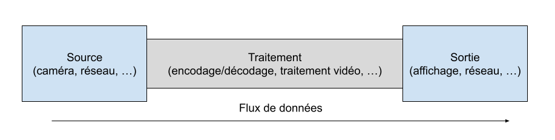
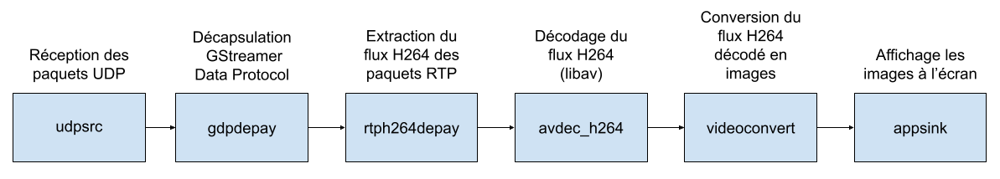
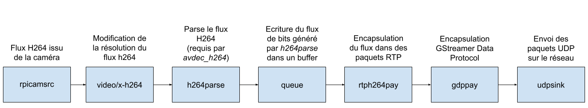
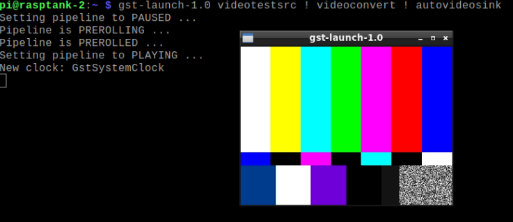
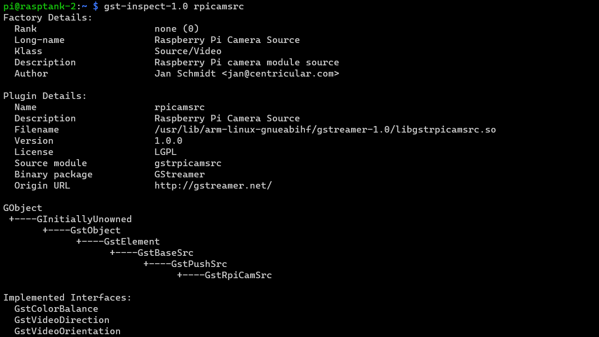
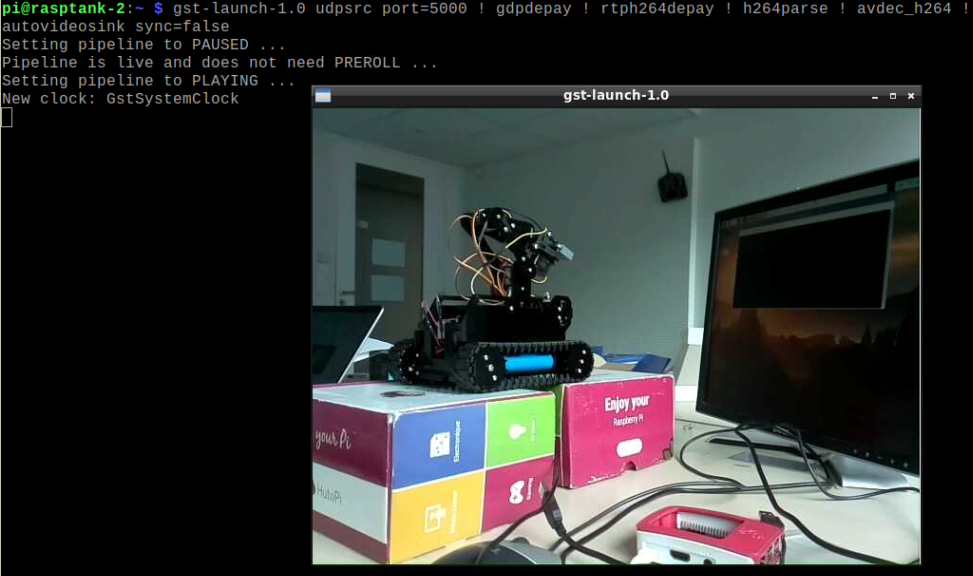
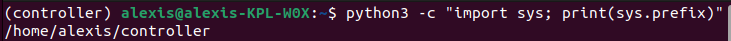
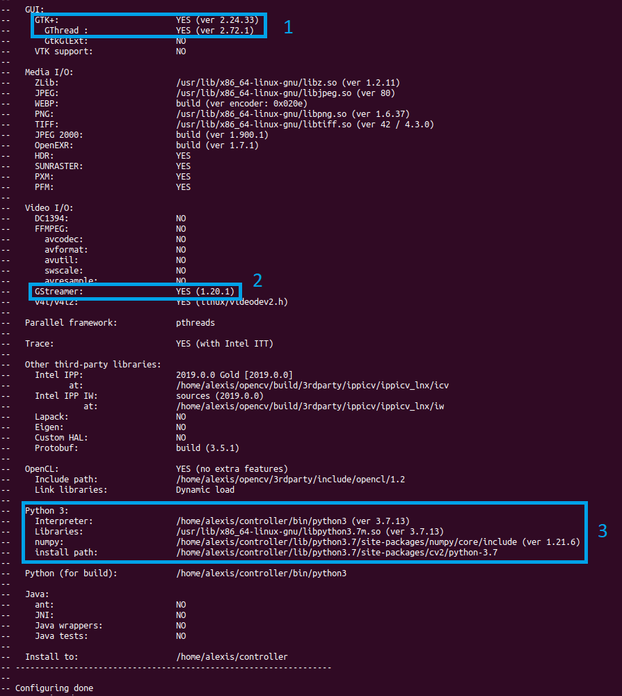
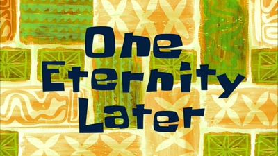

# Guide : Stream de la caméra

## Introduction : Les problèmes liés à la vidéo

Il existe 2 manières de streamer de la vidéo :

1. **MJPEG**

MJPEG pour Motion JPEG consiste à prendre des photos et les envoyer les unes à la suite des autres pour créer une vidéo. Le problème de ce procédé, c'est qu'il consomme énormément en bande passante.

- Une image JPEG non compressée fait entre quelques centaines de KB et peut atteindre le MB. Prenons pour notre exemple une taille de 500 KB par image JPEG. Un stream à 30 fps (frames per second) consommerait alors 500 x 30 x 8 (pour passer en bits) = 120 Mbps soit plus du double de la bande passante moyenne en France qui est de 51 Mbps par habitation (en 2021).

- En compressant nos images JPEG avec une qualité de 50% (compression bien visible à l'œil nu) on peut faire passer la taille moyenne de nos images à 32 KB. Un stream à 30 fps consommerait alors 32 x 30 x 8 = 7.6 Mbps.

7.6 Mbps pour de la 480p ça reste énorme, pour vous donner un ordre de grandeur, une vidéo Youtube en 1080p consomme environ 5 Mbps, alors qu'une image en 1080p est composée de 6.75 fois plus de pixels qu'une image en 480p. 

Cette solution n'est donc pas viable, car avec plusieurs robots, on va très très rapidement saturer la bande passante du routeur (entre 72 et 150 Mbps) et même si la bande passante du routeur n'est pas saturée, cette forte charge sur le réseau va créer de la latence chose qu'on veut à tout prix éviter. En plus de cela, on veut que notre projet soit scalable c'est-à-dire qu'il puisse passer à l'échelle, il faut donc absolument trouver une autre solution.

2. **Codec Vidéo**

La solution, c'est d'utiliser un codec vidéo qui fait de la compression. C'est grâce à ce type de codec qu'une vidéo Youtube en 1080p ne consomme "que" 5 Mbps. Un codec vidéo est un dispositif (matériel ou logiciel) qui encode et décode de la vidéo selon une certaine norme (codec vient de **coder-decoder**). Cette norme décrit le format dans lequel sont encodés les images d'une vidéo. Par exemple, **H264** est une norme vidéo et **x264** est un codec (logiciel) capable d'encoder ou de décoder un flux vidéo dans le format décrit par la norme H264, il existe de nombreux autres codec H264 tel que libav que nous utiliserons par la suite. 

###### Problème de ressources ?

Il existe des codecs hardware dans ce cas, ce sont des composant électroniques spécialement conçus pour encoder/décoder un flux d'une certaine norme. L'avantage de ce genre de composant, c'est qu'ils sont très rapides, on les retrouve par exemple dans le box TV ou ce genre d'équipement. Malheureusement, notre Raspberry n'en possède pas, on va donc utiliser un décodeur software qui est simplement un programme exécuté sur la CPU du Raspberry qui n'est évidemment pas conçu spécialement pour décoder un flux H264 et donc prends plus de temps. Ce que l'on soulève ici, c'est qu'afficher une vidéo issue d'un flux H264 à un certain coût, car en effet, il faut décoder le flux avant de l'afficher contrairement au MJPEG. Si l'appareil qui encode ou décode le flux n'est pas assez puissant, il est possible que cela introduise de la latence sur la vidéo. Heureusement pour nous, grâce aux optimisations du logiciel que l'on va utiliser pour streamer un flux H264, le Raspberry est capable de décoder et afficher un flux H264 en 480p à 30 fps.

###### Principe

Toute cette théorie, c'est bien joli, mais comment concrètement une vidéo Youtube en 1080p ne consomme "que" 5Mbps ? C'est grâce à la compression introduite par la norme H264. En plus de faire de la compression spatiale, c'est-à-dire réduire la qualité d'image comme avec nos images JPEG pour le MJPEG, le H264 introduit le concept de compression temporelle. Voici un exemple de compression temporelle:

- *t0* : On envoie l'image entière

- *t1* : On envoie seulement les pixels qui ont changé par rapport à l'image *t0*

- *t2* : On envoie seulement les pixels qui ont changé par rapport à l'image *t0*

- *t3* : On envoie une nouvelle image entière

- ...



Avec cette technique de compassion temporelle, si l'image ne change pas souvent, comme par exemple pour une caméra de surveillance placé dans une rue peu fréquenté, on divise par 3 la bande passante consommée par le stream de la vidéo.

Dans le cadre de la norme H264, ce sont des techniques bien plus avancés qui sont utilisées, mais vous avez compris le principe. Pour plus de détail concernant les techniques de compression utilisé par la norme H264, la page Wikipédia est bien documentée.

## Implémentation

Plus haut dans l'introduction, j'ai mentionné les optimisations du logiciel qui de streaming qui nous permet d'accomplir la tâche assez compliqué de streamer un flux H264 d'un Raspberry vers un autre Raspberry. Ce logiciel, c'est **GStreamer**.

#### GStreamer

GStreamer permet de faire énormément de choses liées au streaming vidéo, voici les fonctionnalités que l'on va utiliser:

- Encoder un flux H264 (ou peut être pas, cf la suite)

- Envoyer le flux H264 via le protocole UDP

- Recevoir les paquets UDP

- Décoder le le flux H264

- Afficher la vidéo issue du flux H264 décodé

Le fonctionnement de GStreamer est basé sur le principe de pipeline, cela permet de lier entre eux de nombreux "éléments" permettant de créer des workflows complexes tel que dans notre cas, la réception, le décodage, et l'affichage d'un flux H264.

:information_source: Chaque élément du pipeline est séparé par un `!` 

De manière assez générale, on peut résumer un pipeline GStreamer de la manière suivante:



##### Réception du stream (télécommande)

Commande GStreamer à exécuter sur la télécommande:

```python
udpsrc port=5000 ! gdpdepay ! rtph264depay ! avdec_h264 ! videoconvert ! appsink sync=false"
```

Pipeline correspondant à cette commande:



##### Emission du stream (robot)

Commande GStreamer à exécuter sur le robot:

```python
rpicamsrc bitrate=6000000 ! video/x-h264,width=640,height=480 ! h264parse ! queue ! rtph264pay config-interval=1 pt=96 ! gdppay ! udpsink host=10.3.141.138 port=5000
```

Pipeline correspondant à cette commande:



:information_source: Vous l'avez peut-être remarqué, mais dans le pipeline de réception du stream, on évoque le décodage du flux H264 (via *avdec_h264*) alors que dans le pipeline d'émission, on ne mentionne jamais l'encodage du flux H264.

Cela est dû au fait que la vidéo capturé par la caméra (via *rpicamsrc*) est un flux H264. Cela est permis par la caméra elle même qui à l'intérieur contient un petit composant électronique qui transforme les données brutes issu de la caméra en un flux H264, un peu comme une sorte de mini encodeur H264 (en réalité ça n'en n'est pas un). Si le flux en sortie de la caméra n'était pas directement encoder en H264, il aurait fallu utiliser un encodeur software et sur le Raspberry ça aurait pris du temps et donc introduit de la latence au niveau du stream vidéo.

:warning: Il est très important de toujours lancer dans un premier la réception puis ensuite l'émission du stream sinon ça ne fonctionnera pas et GStreamer vous renverra une erreur.

### Installation

Afin de pouvoir utiliser **GStreamer** et **rpicamsrc**, il faut les installer. Il vous faut donc installer GStreamer sur la télécommande et le robot et rpicamsrc uniquement sur le robot.

#### Installation de GStreamer

```console
sudo apt-get install libx264-dev libjpeg-dev
```

```console
sudo apt-get install gstreamer1.0-tools
```

Pour vérifier que *GStreamer* est bien installé

```console
gst-launch-1.0 videotestsrc ! videoconvert ! autovideosink
```



#### Installation de rpicamsrc

```console
git clone https://github.com/thaytan/gst-rpicamsrc.git
```

```console
cd gst-rpicamsrc
./autogen.sh
make
sudo make install
sudo ldconfig
```

Pour vérifier que *rpicamsrc* est bien installé

```console
gst-inspect-1.0 rpicamsrc
```



#### Intégration de GStreamer dans OpenCV

Vous devriez maintenant être capable de streamer la caméra de votre robot vers votre télécommande avec les commandes fournies plus haut dans ce guide.



Maintenant, afin de pouvoir faire du traitement sur la vidéo, comme par exemple de la lecture de QR Code, il faudrait récupérer le flux vidéo directement dans OpenCV et pas dans une fenêtre à part. **OpenCV** (pour Open Computer Vision) est une bibliothèque python qui permet de faire toute sorte de chose en lien avec le traitement d'image et la computer vision.

Afin de donner à OpenCV la faculté de lire le flux vidéo générée par GStreamer, il faut recompiler OpenCV en incluant GStreamer (on le fait seulement pour la télécommande).

##### Recompiler OpenCV avec GStreamer

Je vous conseille très fortement de créer un environnement virtuel python avant de commencer toute manipulation. Cela vous évitera de devoir réinstaller votre OS si vous faites des bêtises avec votre environnement python (ça m'ai arrivé 2 fois lors de la création de ce projet).

###### Création environnement virtuel python

Vous êtes obligé pour des soucis de compatibilité d'utiliser python3.7, si votre télécommande est un Raspberry, le python3 par défaut est python3.7 sinon voici comment l'installer.

```console
sudo apt update
sudo apt install software-properties-common
sudo add-apt-repository ppa:deadsnakes/ppa
sudo apt update
sudo apt install python3.7 python3.7-dev python3.7-venv
```

Création de l'environnement virtuel

```console
python3.7 -m venv controller
source controller/bin/activate
```

Afin de vérifier que vous êtes bien dans un environnement virtuel, tapez la commande suivante

```console
python -c "import sys; print(sys.prefix)"
```

Vous devriez alors avoir ça (ici *controller* est le nom du virtualenv)



###### Bibliothèques requises à la compilation

Installer *CMake* (utilitaire de compilation)

```console
sudo apt install cmake
```

Installer les bibliothèques dev GStreamer

```console
sudo apt install libgstreamer1.0-dev libgstreamer-plugins-base1.0-dev
```

Ensuite il faut installer les bibliothèques graphiques nécessaires, si vous ne le faîtes pas, OpenCV ne pourra pas afficher de la vidéo.

```console
sudo apt install libgtk2.0-dev
sudo apt install pkg-config
```

Enfin il faut installer *numpy*

```console
pip install numpy
```

:warning: Faîtes attention à bien être dans votre environnement virtuel.

###### Compilation de OpenCV

Dans un premier temps, il faut télécharger les sources d'OpenCV depuis leur Github.

```console
git clone https://github.com/opencv/opencv.git
cd opencv/
git checkout 4.1.0
```

Ensuite, on va préparer la compilation d'OpenCV en lui donnant les options de compilation via des flags. On lui donne par exemple le chemin de l'exécutable python pour lequel on veut compiler puis installer OpenCV. C'est aussi grâce à ces flags que l'on peut activer certaines options telles que GStreamer, OpenCV va alors se compiler en incluant GStreamer.

```console
mkdir build
cd build
cmake -D CMAKE_BUILD_TYPE=RELEASE \
-D INSTALL_PYTHON_EXAMPLES=ON \
-D INSTALL_C_EXAMPLES=OFF \
-D PYTHON_EXECUTABLE=$(which python3) \
-D BUILD_opencv_python2=OFF \
-D CMAKE_INSTALL_PREFIX=$(python3 -c "import sys; print(sys.prefix)") \
-D PYTHON3_EXECUTABLE=$(which python3) \
-D PYTHON3_INCLUDE_DIR=$(python3 -c "from distutils.sysconfig import get_python_inc; print(get_python_inc())") \
-D PYTHON3_PACKAGES_PATH=$(python3 -c "from distutils.sysconfig import get_python_lib; print(get_python_lib())") \
-D WITH_GSTREAMER=ON \
-D BUILD_EXAMPLES=ON ..
```

Avant de continuer vérifier biens les 3 points suivants dans les logs:

1. GTK+ est bien détecté :white_check_mark:

2. GStreamer est bien détecté :white_check_mark: 

3. Le chemin de l'interpréteur python est le bon (environnement virtuel) :white_check_mark: 



Une fois ces vérifications faites, vous pouvez lancer la compilation (cela prend quelques dizaines de minutes).

```console
sudo make -j$(nproc)
```



###### Installation de *votre* version de OpenCV

```console
sudo make install
sudo ldconfig
```

Afin de vérifier que OpenCV est bien installé

```console
python3 -c "import cv2; print(cv2.getBuildInformation())"
```

Une fenêtre de logs identique à celle vue précédemment, va alors s'ouvrir, vérifier les mêmes 3 points.

###### Utiliser GStreamer dans OpenCV

Une fois la compilation et l'installation terminées, vous devriez maintenant être capable de lire un flux H264 décodé par GStreamer dans OpenCV avec le code suivant:

```python
import numpy as np
import cv2

cap = cv2.VideoCapture("gst-launch-1.0 udpsrc port=5000 ! gdpdepay ! rtph264depay ! h264parse ! avdec_h264 ! autovideosink sync=false", cv2.CAP_GSTREAMER)


while cap.isOpened():
    ret,frame = cap.read()
    if not ret:
        print('Error')
        continue

    cv2.imshow('Stream', frame)
    if cv2.waitKey(1)&0xFF == ord('q'):
        break

cap.release()
```

:bulb: Pour l'émission, utiliser la ligne de commande présentée précédemment.

#### Lancer GStreamer avec python

Pour lancer le stream, on utilise GStreamer depuis le terminal, ce que l'on veut pour notre robot, c'est qu'il lance le stream quand le programme python du robot se lance, on pourrait alors faire la chose suivante:

```python
os.system("gst-launch-1.0 ...")
```

Le problème avec cette méthode, c'est que lorsque que l'on arrête le programme du robot, le stream ne s'arrête pas. Pour résoudre ce problème, on va interagir avec GStreamer directement depuis notre programme python.

Importer GStreamer

```python
import gi 
gi.require_version('Gst', '1.0')
from gi.repository import Gst, GLib
```

Initialisation de GStreamer

```python
Gst.init()
```

Création du Thread GStreamer

```python
videoStream = GLib.MainLoop()
videoStreamThread = threading.Thread(target=videoStream.run)
videoStreamThread.start()
```

Pipeline GStreamer

```python
pipeline = Gst.parse_launch("rpicamsrc bitrate=6000000 ! video/x-h264,width=640,height=480 ! h264parse ! queue ! rtph264pay config-interval=1 pt=96 ! gdppay ! udpsink host=X.X.X.X port=5000")
```

Lancer GStreamer

```python
pipeline.set_state(Gst.State.PLAYING)
```

Arrêter le stream

```python
pipeline.set_state(Gst.State.NULL)
videoStream.quit()
videoStreamThread.join()
```

Voilà, vous pouvez maintenant lancer un stream avec GStreamer depuis un python.
