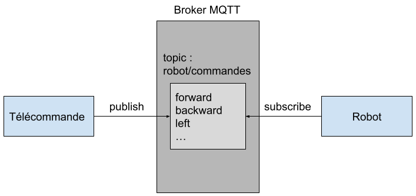

# Idées : Communication Télécommande - Robot

Vous êtes libre d'implémenter la communication entre la télécommande et le robot de la manière dont vous souhaiter. Vous trouverez tout de même quelques idées ci-dessous.

### Communication via `socket`

Vous pouvez créer une connexion TCP entre la télécommande et le robot. Vous pourrez ensuite via cette connexion envoyer des commandes sous forme de texte.

**keywords** : *python socket tcp connection*

### Communication via `MQTT` :star:

Vous pouvez aussi utiliser le protocole MQTT afin d'envoyer des commandes au robot. Pour cela votre télécommande publie les commandes sur le topic `robot/commandes`. De l'autre côté votre robot s'abonne à ce topic ce qui lui permet de recevoir les commandes.

:warning: Si vous utilisez le Broker MQTT du serveur central (10.3.141.1) merci d'utiliser le topic suivant:  tanks/**@_MAC_robot**/commands

*ex* : tanks/0xdca632bf91cc/commands

***keywords*** : *paho mqtt python send message*

##### Polling vs Interruptions

Je vous recommande très fortement de choisir l'option qui utilise **MQTT** car elle permet l'utilisation des **interruptions**.

Il y a deux manières de recevoir une commande via le réseau.

1) On écoute en permanence pour voir si une commande est arrivée, donc par exemple toutes les secondes le CPU demande à la carte réseau si une commande est arrivée, c'est le **polling**.

2. Quand la carte réseau reçoit une commande, elle envoie un message au CPU pour lui dire qu'une commande est arrivée, c'est une **interruption**.

Dans le cadre de notre projet on fait du temps réel, il est donc important qu'au moment où on demande au robot d'avancer, il avance. Or si on vérifie toutes les secondes si on a reçu un message, il y aura environ 1 seconde de latence.

Vous allez me dire qu'on pourrait vérifier toutes les 100 ms si on a reçu un message. Le problème c'est que cette demande à un coût.

À chaque fois que le CPU demande à la carte réseau si une commande est arrivée, il ne fait rien d'autre. Que se passe-t-il alors si pendant cette demande à la carte réseau, le robot rentre dans la zone de capture ? Le robot ne va pas détecter qu'il est entré dans la zone et donc la capture du drapeau ne va pas commencer.

**TL;DR** : Les interruptions c'est cool, essayez toujours de les utiliser si vous le pouvez.
